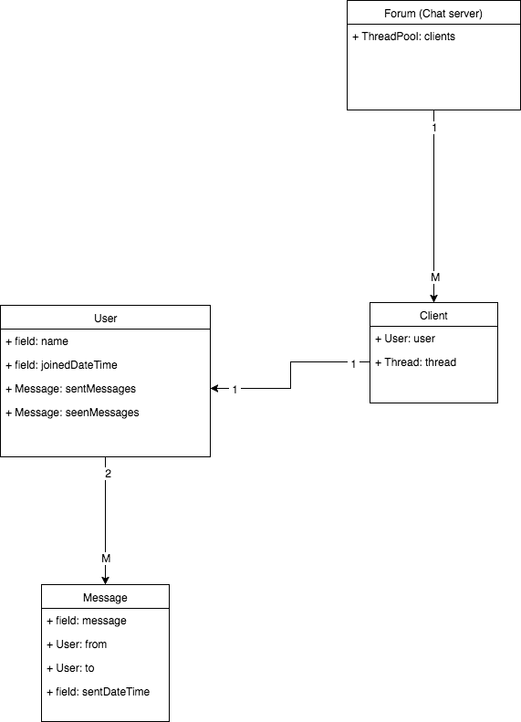
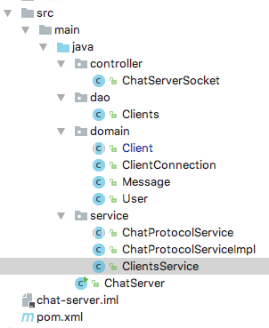

# CA1 | Solution | Jonas Schelde

[Here](https://github.com/CphBusCosSem3/Exercises/tree/master/CA/CA1) is the teachers assignment github repo

## Chat protocol

[Here](https://github.com/scheldejonas/Exercises/blob/master/CA/CA1/protocol.md) is the layed out school class decided protocol.

#### Design choices

- The protocol, is built as an abstract class for having the main intepretations of commands completly the same on both clients as server.

- The abstract protocol, looks like this then:

- ```java
  package service;

  /**
   * Created by scheldejonas on 17/04/2017.
   */
  public abstract class ChatProtocolService {

      public abstract ServerCommand analyseServerLine(String newLine);

      public abstract ClientCommand analyseClientLine(String newLine);

      enum ServerCommand {
          SEND_MESSAGE_TO_FORUM(1)
          ,SEND_MESSAGE_TO_ONE_USER(2)
          ,LOGIN_USER_TO_FORUM(3)
          ;

          private final int id;

          ServerCommand(int id) {
              this.id = id;
          }

          public int getId() {
              return id;
          }
      }

      enum ClientCommand {
          ADD_MESSAGE(1)
          ,ADD_PRIVATE_MESSAGE(2)
          ,UPDATE_LIST_OF_ACTIVE_USERS(3)
          ,INFORM_ATTEMPTED_USERNAME_ON_LOGIN_WAS_ALREADY_USED(4)
          ,REMOVE_USER_FROM_ACTIVE_USERS(5)
          ;

          private final int id;

          ClientCommand(int id) {
              this.id = id;
          }

          public int getId() {
              return id;
          }
      }
  }
  ```

- Mainly it is used as a intepreter or translater of the text being sent between clients and servers.

- From what happens after, is up to the controllers and service objects, of the data being passed around, to understand and distribute.

  #### Server interpretation of the protocol

- ```java
  package service;

  /**
   * Created by scheldejonas on 17/04/2017.
   */
  public class ChatProtocolServiceImpl extends ChatProtocolService {

      private static final ChatProtocolServiceImpl singleton = new ChatProtocolServiceImpl();

      private ChatProtocolServiceImpl() {
      }

      public static ChatProtocolServiceImpl getSingleton() {
          return singleton;
      }

      @Override
      public ServerCommand analyseServerLine(String newLine) {
          String[] newTextLineInArray = newLine.split("#");
          System.out.println("...Starting to analyse new received textline from client on server: " + newLine);
          if (newTextLineInArray[0].equals("LOGIN")) {
              return ServerCommand.LOGIN_USER_TO_FORUM;
          }
          if (newTextLineInArray[0].equals("MSG")) {
              if (newTextLineInArray[1].equals("ALL")) {
                  return ServerCommand.SEND_MESSAGE_TO_FORUM;
              }
              if (!newTextLineInArray[1].equals("ALL")) {
                  return ServerCommand.SEND_MESSAGE_TO_ONE_USER;
              }
          }
          return null;
      }

      @Override
      public ClientCommand analyseClientLine(String newLine) {
          return null;
      }

  }
  ```

- From this, the server now, clear have the correct command to follow, upon it's clients.

  #### Client interpretation of the protocol

- ```

  ```

- ?

## Chat Server

#### Design choices

- We have written the protocol in an interface firstly, to make sure what kinds of options you would have in this protocol.
- Also to have a way to overview, what is possible in terms of method, on the client, as to the service.
- Then of course there is just different kinds of implementations on the server and the client.
- The design is created with top-down approach, in the way; There is a server setup and a client setup.
- To this top-down structure design, each setup, both server and client, is seperated with a kind of industri standard package pattern named like this:
  - Web (here usually the .jsp files or other html files is placed to be used before responding to the user)
  - Controller (directs the requests and controls the threads overview)
  - Service (services the entities or the handles the data through the protocol for example, to be directed back to the controller or directly to be persisted for longer saving in the db, through dao)
  - Dao (this controls data acces to the database, keeping all data sent and recieved from database persistent)
  - Database (the relational table base with data saved)
- Here is our Data modal, as initiated database inside the java chatserver:




- The folder structure of the server application, is then looking like this.
- 
- ```root/ChatServer```  is containing the main method, that starts the ChatServerSocket as an thread.
- ```controller/``` folder is to have the ingoing new connection handeling to the server. ChatServerSocket, can be initiated and binded to a port. When this is done, a while loop with a reentrantlock is placed in the run method, from the implementation for Runnable.
- ```service/``` folder is then where ```ChatServerSocket``` sends all the new connection down, and get's them mounted to a ClientConnection object, with the savings and start of a runnable while loop for receiving text lines, from the open socket connection. This is for singleton initiated classes
- ```dao/``` folder is then to have all the initiated Messages, Users, Clients as ClientConnections saved, either as active or disconnected clients, in the ```Clients``` class.
- ```domain/``` is the entity's of the data model layed out. And initiated through the Clients "database" in ```dao```  package.

## Web server

And to end this project, the demands were to let this client and server be available on the web through a web server with https.

it is therefore online and working on this link:

- [online web server with chat client and server for download](https://77.66.48.34)

---
