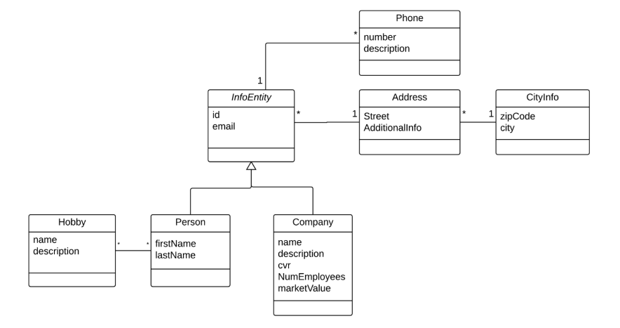

## Objevt Relational Mapping, REST, Test, Ajax and JavaScript

This CA builds a proof of cencept solution, for what could have been a real life system.

For this reason we assume there will be a notable difference in how far the different teams will come.

###### <u>This CA will strengthen your skills and knodledge related to:</u>

- Use an ORM (JPA) to map between Java object and Raltional Tables
- Use an ORM (JPA) to map Java inheritance to Relational Tables
- Expose business functionality via a REST-API and JSON.
- Handle exceptions via a REST-API and JSON
- Test a REST-API, using both-tests on the data model, and tools like REST Assured to test the API.
- Build dynamic web-pages that builds content via JavaScript (Using AJAX calls to a server REST-API)

### Hand-in and Documentation

- The code must be made available via Github

- All documentation, the REST-API and the projects web-pages must be made available via a small web-site publised on your WEB-server.

- Documentation must include (each with a separate heading or a separate page):

  - A complete description of the REST API, error responses and JSON format
  - A section explaining your test strategy, including test results
    - For plain Unit Test
    - Testing the Database face
    - Testing the REST API
  - A section stating who did what.
  - A description of the strategy to implement inheritance and why this strategy was chosen.

- A clear and precise description of <u>how to test the system</u>. We will not do a class demo for this CA, so the documentation must include a description of how:

  - We can test the API via your implemented test cases using REST Assured
  - To use the web pages that uses the API.

- You must all include the following elements in your CA-2 front-page, to identify your group:

  - Feel free to style it anyway you like, but the id's must be exactly as below:

    - ```html
      <div id="authors">Peter Hansen, Ole Jensen, Ida Hansen</div>
      <div id="class">A or B or COS</div>
      <div id="group">Group number</div>
      ```


This is meant for an exercise in Module-3, so ensure you're CA-2 website is up, at least until the exam.

## How to spend your four days

You are supposed to develop the system over 2 consecutive two-day mini sprints as sketched below:

- Day 1+2: Before the end of day 2 you must demonstrate your REST-API (backend)
- Day 3+4: Complete the Front-end, missing back-end parts, the documentation and deploy the system


## How to complete this CA in only four days

This CA is time intensive and if you are pressed for time, it is more important that you complete a little bit of all tasks, instead of completing all the steps of only a few tasks.

This CA is meant to be impossible to complete in only four days. So you must take advantage of the fact that you are two or three persons in a team and distribute (sprint) tasks between team members.

### Studypoints for this (4-week) period + CA are given below


| Description                              | Points     |
| ---------------------------------------- | ---------- |
| For your participation in the class      | 16 points  |
| For the three SP exercises               | 15 points  |
| Each member in a team can earn additional 19 points for the CA as sketched below: |            |
| For your contribution to the code and documentation (verified via Git, attendance in the class) | 1-5 points |
| For the demonstration + test of the REST-API (the backend) Day-2 | 1-3 points |
| The quality of your design and documentation | 1-3 points |
| Quality/coverage and description of your tests (backend test and API-test) | 1-4 points |
| For the testing/demo of the final system (Friday) | 1-4 points |


##### Bonus Points:

While you develop this system you will acquire knowlodge about many small details, which initially might take you a lot of time to figure out.

You should try to help each other, so if you have a problem, ask if any of your classmates can help 

(and respect if the reply is - wait we are doing something else right now.)

If you feel you have received helpful hints from somebody during this sprint, you can suggest (via your documentation) that they are rewarded an EXTRA study point.

A team/person can receive up to five extra study points in this way, if suggested by more than one team (max one point per team)

**Hand-in: Sunday (19.03.2017) before 18.00**

## Before you start

Before you start it is recommended that you read the section "Background, REST-API's, DTO's and JSON" at the end of this document.

#### The business domain

A new company plans to join the market for information about people and companies (like Krak, De Gule Sider etc.). They plan to offer services like:

- Get information about a person (address, hobbies, etc.) fiven a phone number.
- Get information about a company ficen a phone number or cvr.
- Get all person with a given hobby.
- Get all persons living in a given city (i.e. 2800 Lyngby)
- Get the count of people with a given hobby
- Get a list of all zip codes in Denmark
- Get a list of companies with more than xx employes
- Etc.:
  - In order to set up data, the API must also provide methods to add, delete and edit the Entities

Initially the following simplified version fo the business domain has been approved as the background for a quick prototype application.




