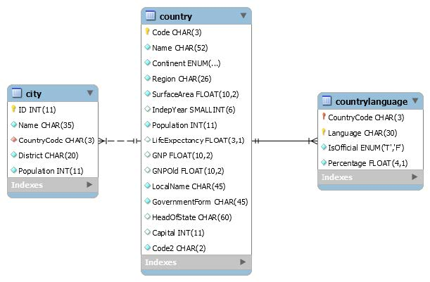

# JPA REST API

The task description [here](https://github.com/scheldejonas/Exercises/blob/master/EP/exam-preparation_JPA_REST_API.pdf)

## General part

- Elaborate on some of the characteristics of REST, like: Stateless, Cacheable, Layered System, Uniform Interface etc.

  - Stateless: Because it is used over http

  - Cacheable: The data in ORM system can be constantly running, for stateless fetch calls to just get the newest data available

  - Layered System: The multiarhcitectural setup with facade, controllers and endpoints to separate concerns and more.

  - ##### Uniform interface

    The uniform interface constraint is fundamental to the design of any REST service.[[2\]](https://en.wikipedia.org/wiki/Representational_state_transfer#cite_note-Fielding-Ch5-2) It simplifies and decouples the architecture, which enables each part to evolve independently. The four constraints for this uniform interface are

    - Identification of resources

      Individual resources are identified in requests, for example using [URIs](https://en.wikipedia.org/wiki/Uniform_resource_identifier) in Web-based REST systems. The resources themselves are conceptually separate from the representations that are returned to the client. For example, the server may send data from its database as [HTML](https://en.wikipedia.org/wiki/HTML), [XML](https://en.wikipedia.org/wiki/XML) or [JSON](https://en.wikipedia.org/wiki/JSON), none of which are the server's internal representation.

    - Manipulation of resources through representations

      When a client holds a representation of a resource, including any [metadata](https://en.wikipedia.org/wiki/Metadata) attached, it has enough information to modify or delete the resource.

    - Self-descriptive messages

      Each message includes enough information to describe how to process the message. For example, which parser to invoke may be specified by an [Internet media type](https://en.wikipedia.org/wiki/Media_type) (previously known as a [MIME type](https://en.wikipedia.org/wiki/MIME_type)).[[2\]](https://en.wikipedia.org/wiki/Representational_state_transfer#cite_note-Fielding-Ch5-2)

    - Hypermedia as the engine of application state ([HATEOAS](https://en.wikipedia.org/wiki/HATEOAS))

      Having accessed an initial URI for the REST application—analogous to a human Web user accessing the [home page](https://en.wikipedia.org/wiki/Home_page) of a website—a REST client should then be able to use server-provided links dynamically to discover all the available actions and resources it needs. As access proceeds, the server responds with text that includes [hyperlinks](https://en.wikipedia.org/wiki/Hyperlink) to other actions that are currently available. There is no need for the client to be hard-coded with information regarding the structure or dynamics of the REST service.[[12\]](https://en.wikipedia.org/wiki/Representational_state_transfer#cite_note-RESTfulAPI.net-12)

- Elaborate on how JSON or XML supports communication between subsystems, even when the subsystems are implemented on different platforms. 

  - JSON or XML supports communication between subsystems, by being requested from the client, with JavaScript code.

    XML stand for Extensible markup language, and has the same syntax with tags as html has, but the difference is xml has no limitations as to what you can name the tags. So for that reason xml tags can be named your collection names and inside those collections named tags you can have a xml tag for each entity instance, with it property fields as further xml tags inside.

    JSON stands for JavaScript Object Notation and is directly possible to use in the syntax as JavaScript objects.

    Basicly you use the Content-Type HTTP Header, do describe it for example is JSON you are sending in your HTTP Post request, to the server.

## Practical part

- Execute the script (use the file *world.sql *on Fronter, I have added a small change to simplify Entity-modelling), from MySQL Workbench, to setup the world database 
  - **world.sql is downloaded and inserted** from http://dev.mysql.com/doc/index-other.html

- Use the NetBeans Wizard to create a set of matching Entity-classes Hint. Do not assume that all data exists, not even that a country have a capital, so make sure to do null checks on your data. 
  - **domain package in project_v2**
- The main task for this exercise is to design a REST API given the specifications below: 
  It must be possible to: 
  1. Get a list of all countries, with *code*, *name*, *continent *and the *name *of the capital
     1. **getAllCountriesWithFourColumns in CountryRessource** (Getting all countries with all columns, but where capital is not null. After that )
  2. Get a list of all countries with a population greater than an number provided (return data as above) 
     1. **getAllCountriesWithFourColumns in CountryRessource** (Getting all countries with a QueryParam on minimumPopulation)
  3. Get a list of all cities in a country (provided the Country code) including name and population 
     1. **getAllCitiesWith in CityRessource** (Getting all cities filtered by countryCode with a QueryParam)
  4. Create a new city for a Country
     1. **createCityInCountry in CityRessource** (Getting all new field valeus for creating and then persisting.)
- For each service you should: Define the API call (URI) and the (JSON) format used to transfer data back and forth between Client and Server.
  - ​
- Test the REST API using a browser for the GET methods and Postman for the POST method (or using Rest Assured if you prefer).
  - Done - Works
- If you have time create an HTML page that could fetch and show data (using JQuery or Angular) for some of the methods created above.
  - … brw.