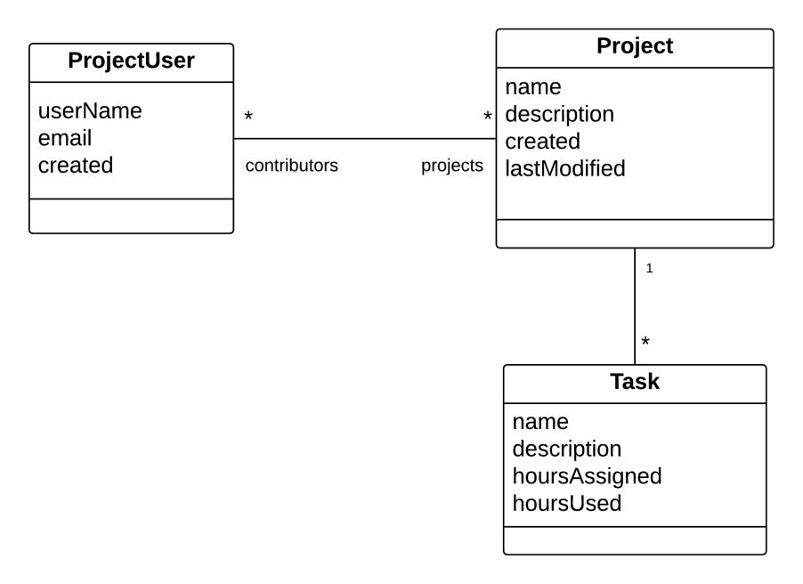

# JPA1

The task description [here](https://github.com/scheldejonas/Exercises/blob/master/EP/exam-preparation_JPA1.pdf)

## General part

- Describe how you have handled persistence in the last three semesters. 
  - At the start of our database journey !! … we established database connections using mappers from our own stash. We brought the winery to help ! So then by creating SQL code, for each variables, with for example get methods that had SQL SELECT for each of them.
  - Then following up on our journey ! The next thing was ORM - Object Relational Mapping Frameworks, to help us in a controlled persistence set of steps, to save update or retrieve data from the database.
  - So the controlling of SQL errors, complexity and scalability is solved algorithmic by ORM frameworks.
- The considerations should include all relevant layers. File IO, Relational Databases, local storage and cookies in browsers.
  - The File IO
    - Before ORM, there was no cache involved to make the http requests to our servers faster. Therefore each get method for an instance field, was waiting for the actual database response.
    - After ORM, there is a live version of the object instance, to just be retrieved by the requests.
  - Relational Databases
    - Any Database is table related meaning the 3D understanding of a object model is not the same.  Say a many to many relation needs it's own seperate table to hold crossing relations between objects.
    - After ORM, it became the Frameworks job to create those object relations into corresponding tables with foreing keys to make it function proberly.
  - Local Storage
    - Local on Server. The ORM takes fully care of the cache for data by it self.
    - Local on Client Browser. We haven't been setting it up with cookiesessionid's for remembering both on browser and server who the client is, and what data is already sent to the client.
  - Cookies in browser
    - We have only touched the HTTP headers ability to control if the get method returns no-cache headers or not. With this you can set, if the standard cache/cookie setting should not be used on you page responses.
- Explain the Pros & Cons in using an Object Relational Mapping Framework 
  - Pros
    - Ease to use
    - Caching is self controlled
    - No relational Table Creation or Managing
    - Controlling of several requests to the cache and database at the same time - Multithreading.
    - Automatic Error handling 
    - Less knowledge needed to setup a database persistence
  - Cons
    - Caching errors
    - Speed is a bit smaller, when you need to retrieve from the database and not using cache.
    - Nothing
- Elaborate on some of the problems a ORM tries to solve 
  - All the pros, self explained...
- Explain the basic “components” involved when using Java’s JPA 
  - EntityManagerFactory is for creating connection to database
  - EntityManager is for sending and retrieving data to the database
  - Transaction is for starting a data persist to the base.
  - persistence.xml, is for setting basic ORM options, to control scanning of entiti's
  - Entity annotation and sub annotations.

## Practical part

1. Examine and understand the diagram. Use Object Relational Mapping (using JPA) to implement the OO classes and the corresponding Database Tables. 
   1. **Project** (private Variables annotated and with Column name annotations, Project class is annotated table per class, Relation to ProjectUser is annotated ManyToMany, and Relation to Task is annotated OneToMany(mappedBy= "project"))
   2. **ProjectUser** (private Variables annotated with columns. ProjectUser class annotated with table per class inheritance strategy and table name. Relation to Project is annotated with ManyToMany)
   3. **Task** (private Variables annotated with columns. Task class annotated with table per class inheritance strategy and table name. Relation to Project is annotated with ManyToOne)
2. Create a façade class and implement as many of the methods below as you have time for (not necessarily in the order given): 
   1. Create user
   2. Find user 
   3. Get all users 
   4. Create project 
   5. Assign user to project 
   6. Find project 
   7. CreateTaskAndAssignToProject 
   8. Etc. 
      1. **Application** (Start the look on solution from Application class, with comments on where each is implementeted.)