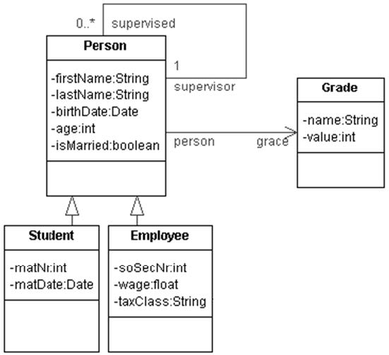

# JPA2

The task description [here](https://github.com/scheldejonas/Exercises/blob/master/EP/exam-preparation_JPA2.pdf)

## General part

- Describe how you have handled persistence in the last three semesters. 
  - At the start of our database journey !! … we established database connections using mappers from our own stash. We brought the winery to help ! So then by creating SQL code, for each variables, with for example get methods that had SQL SELECT for each of them.
  - Then following up on our journey ! The next thing was ORM - Object Relational Mapping Frameworks, to help us in a controlled persistence set of steps, to save update or retrieve data from the database.
  - So the controlling of SQL errors, complexity and scalability is solved algorithmic by ORM frameworks.
- The considerations should include all relevant layers. File IO, Relational Databases, local storage and cookies in browsers.
  - The File IO
    - Before ORM, there was no cache involved to make the http requests to our servers faster. Therefore each get method for an instance field, was waiting for the actual database response.
    - After ORM, there is a live version of the object instance, to just be retrieved by the requests.
  - Relational Databases
    - Any Database is table related meaning the 3D understanding of a object model is not the same.  Say a many to many relation needs it's own seperate table to hold crossing relations between objects.
    - After ORM, it became the Frameworks job to create those object relations into corresponding tables with foreing keys to make it function proberly.
  - Local Storage
    - Local on Server. The ORM takes fully care of the cache for data by it self.
    - Local on Client Browser. We haven't been setting it up with cookiesessionid's for remembering both on browser and server who the client is, and what data is already sent to the client.
  - Cookies in browser
    - We have only touched the HTTP headers ability to control if the get method returns no-cache headers or not. With this you can set, if the standard cache/cookie setting should not be used on you page responses.
- Explain the Pros & Cons in using an Object Relational Mapping Framework 
  - Pros
    - Ease to use
    - Caching is self controlled
    - No relational Table Creation or Managing
    - Controlling of several requests to the cache and database at the same time - Multithreading.
    - Automatic Error handling 
    - Less knowledge needed to setup a database persistence
  - Cons
    - Caching errors
    - Speed is a bit smaller, when you need to retrieve from the database and not using cache.
    - Nothing
- Elaborate on some of the problems a ORM tries to solve 
  - All the pros, self explained...
-  Explain how Inheritance in an OO language can be mapped to tables in a relational database 
  - There is SINGLE_TABLE, JOINED, TABLE_PER_CLASS.
  - **SINGLE_TABLE** makes a DTYPE column, for knowing what object type the row is. In this table all extended objects to the super object is here with it's columns.
  - **JOINED** makes objects of the super class into separate tables, with an id, pointing to the super class's table.
  - **TABLE_PER_CLASS** is not possible to use, when having extended objects. This is just used as default when having a single entity with relations through OneToMany and ManyToMany.

## Practical part

1. You must present both the JPA entity classes and the corresponding tables. You decide whether you want to create the tables first and then the Entity classes or the other way around. 
   1. **Person** (is the super class of Student and Employee. )
   2. **Student/Employee** (has the 2/3 variables, and a super constructor)
   3. **Grade** (is a ManyToOne relation to a person, and in Person there is a OneToMany List of Grades)
2. It's up to you to decide which Inheritance Strategy to use, but you must argue for your choice.
   1. **Person** (Inheritance strategy is SINGLE_TABLE, the reason is to have a ease of bug fixing when validation of data inputs neeeds to be done.)
      1. But after consideting the real world example: We think that grade is not related to Employee's. This makes Grades only have a OneToMany relation on Students.
         Then in that case a TABLE_PER_CLASS strategy for Student and Employee is a better architecture for achieving 3. Normalform.
   2. **Grade** (Inheritance strategy is TABLE_PER_CLASS, the reason is, there is no extendings of objects to Grade)
   3. **Student/Employee** (Inheritance strategy a part of Person)
3. Make a small façade which should make it possible to:
   1. **add, edit, find **and **delete **Persons, Students, Employees and PhDStudients 
      1. **PersonDao** (has the methods made and ready for use)
   2. Provide necessary getters and setters to the Person hierarchy so all information is available, for example who is a Persons supervisor and the list of who a Person supervises. 
4. If you have time. Provide a small rest API that, using the façade, manipulates the database 
   1. ?