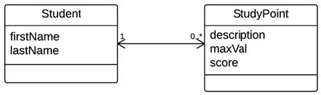

# JPQL

The tast description [here]()

## General part

- Describe how you have handled persistence in the last three semesters. 
  - At the start of our database journey !! … we established database connections using mappers from our own stash. We brought the winery to help ! So then by creating SQL code, for each variables, with for example get methods that had SQL SELECT for each of them.
  - Then following up on our journey ! The next thing was ORM - Object Relational Mapping Frameworks, to help us in a controlled persistence set of steps, to save update or retrieve data from the database.
  - So the controlling of SQL errors, complexity and scalability is solved algorithmic by ORM frameworks.
- The considerations should include all relevant layers. File IO, Relational Databases, local storage and cookies in browsers.
  - The File IO
    - Before ORM, there was no cache involved to make the http requests to our servers faster. Therefore each get method for an instance field, was waiting for the actual database response.
    - After ORM, there is a live version of the object instance, to just be retrieved by the requests.
  - Relational Databases
    - Any Database is table related meaning the 3D understanding of a object model is not the same.  Say a many to many relation needs it's own seperate table to hold crossing relations between objects.
    - After ORM, it became the Frameworks job to create those object relations into corresponding tables with foreing keys to make it function proberly.
  - Local Storage
    - Local on Server. The ORM takes fully care of the cache for data by it self.
    - Local on Client Browser. We haven't been setting it up with cookiesessionid's for remembering both on browser and server who the client is, and what data is already sent to the client.
  - Cookies in browser
    - We have only touched the HTTP headers ability to control if the get method returns no-cache headers or not. With this you can set, if the standard cache/cookie setting should not be used on you page responses.
- Explain the Pros & Cons in using an Object Relational Mapping Framework 
  - Pros
    - Ease to use
    - Caching is self controlled
    - No relational Table Creation or Managing
    - Controlling of several requests to the cache and database at the same time - Multithreading.
    - Automatic Error handling 
    - Less knowledge needed to setup a database persistence
  - Cons
    - Caching errors
    - Speed is a bit smaller, when you need to retrieve from the database and not using cache.
    - Nothing
- Elaborate on some of the problems a ORM tries to solve 
  - All the pros, self explained...
- Discuss the methods we can use to query a JPA design and compare with what you explained above 
  - There is the dynamic query, which we are writing our self, by objects and jpql language lines.
  - There is also the named queries, that get's created for us to use, in simple get cases, for all or by some field of the enity easily.

## Practical part

1. Create a new MySQL database **jpqlDemo**, either from within Netbeans or using MySQL Workbench.
   1. **DataGrip** / **NaviCat** (Database schema created)
2. Create a new plain java project; **jpqlDemo **with NetBeans.

​	1. **Application** (Created a Maven project with settings to java 1.8)

3. In this project create a folder **scripts **and copy the file *studypoints.sql *into this folder and execute the script on the jpqlDemo database. 
   1. **Database** (got created 2 tables: **Student** and **StudentPoint**)
4. Use the NetBeans Wizard "New Entity Classes from Database" to create a pair of matching Entity Classes.
   1. **domain**  (Classes got imported with annotations for Hibernate)
5. Investigate the generated Entity classes and observe the NamedQueries generated by the Wizard. 
   1. **Student** (The named queries are able to use, from EntityManager.createNamedQuery("Student.findById").setParameter("id", id) );
   2. **Student** (All entity's are able to continue to make from here then)
6. Create the Dynamic Queries (or when possible, use one of the named Queries generated by the wizard) to solve the following problems: 
   1. Find all Students in the system
      1. **findAllStudents in StudentFacade** (Used createNamedQuery, with the given name in the entity class on top of java file.)
   2. Find all Students in the System with the first Name jan 
      1. **findAllStudentsByFirstname in StudentFacade** (We setup a paramater as the firstname, so the dynamic query we created can get by any given firstnam)
   3. Find all Students in the system with the last name Olsen
      1. **findAllStudentsByLastname in StudentFacade** (We setup a paramater as the lastname, so the dynamic query we created can get by any given lastname)
   4. Find the total sum of study point scores, for a student given the student id. 
      1. **getSumOfStudypointsByStudentId in StudypointFacade** (We setup a id paramater as int to filter on foreign key in Studypoint table in db. with this, just select sum (p.score) )
   5. Find the total sum of studypoint scores, given to all students.
      1. **getSumOfAllStudypoints in StudypointFacade** (No parameters, because it is just a sum of all rows in Studypoint Table)
   6. Find those students that has the greatest total of studypoint scores
      1. **getStudentWithGreatestScore in StudentFacade** (We have first choosen to go into Studypoint objects, then selecting students trough foreign key. after that group this by the student id, to make it on line per student, and after this order by sum of score, in desc order, which we then take the 0 index result of.)
   7. Find those students that has the lowest total of studypoint scores 
      1. **getStudentWithGreatestScore in StudentFacade** (Same as above, just the minimal result, with asc order.)
7. Create the following methods to insert new data into the system 
   1. Create a method to create new Students and test the method 
      1. **create in StudentFacade** (persisting a new object to the database, with persist method.)
   2. Add a method to the Student class addStudyPoint(..) and test the method
      1. **addStudypoint in Student & update in StudentFacade** (first adding a study point to the list on the student, and afterwards using the merge function to update it in db as foreign key value on the studypoint line.)