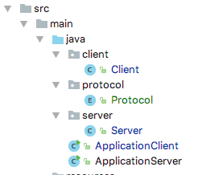

# Network

Here is the initial task description [here](https://github.com/scheldejonas/Exercises/blob/master/EP/Exam-preparation-network.pdf)


## General part


 Explain about Thread Programming including: 

- When and why we will use Threads in our programs? 
  - We are using threads in a program when we wanted to seperate requests made from the Users on to more Processors.
- Explain about the Race Condition Problem and ways to solve it in Java?
  - Race Condition is problems on variables or refenrece spaces in ram being accesed from 2 or more different threads, in a value destroying order.
  - The ways to solve Race condition is by placing our threads on the highest level of java code control to run a whole section of code, before next request is able to use those specified instructions in the given methods and variables bound to that section. Use Synchronized methods, Reentrant Locks and Atomic Variables to solve it in code sections.
- Explain how we can write reusable non-blocking Java Controls using Threads
  - By making the controls be coded in a run method and implement the runnable interface.
  - From that in our Application main class, have say a CachedThreadPool Object, to start and execute the incoming jobs to Control classes.
    - For example a TCP server in it's controller waiting for new incoming connections. When ever it receives, it passes the info on to a runnable class in the model layer, for execution synchronously. And all of this is handled in a CachedTheadPool, to make it managed for preventing starvation, race conditions and deadlocks better.
- Explain about deadlocks, how to detect them and ways to solve the Deadlock Problem 
  - For example:
    - Detecting deadlocks, is when code is written with lock.lock() locks.
    - Also deadlocks is when running a sleeping method or oberserving method that has lock on it.


### Practical part

- Design a TCP server and a simple protocol where each turnstile initially reports that it is a Turnstile (to distinguish from Monitor-Clients, see next step), its id (turnstile1-turnstile-n) and then reports an increment for each spectator that passes the turnstile

  - This is the Server it self, without Threading

  - ```java
    package server;

    import protocol.Protocol;

    import java.io.BufferedReader;
    import java.io.IOException;
    import java.io.InputStreamReader;
    import java.io.PrintWriter;
    import java.net.ServerSocket;
    import java.net.Socket;
    import java.util.ArrayList;
    import java.util.List;

    /**
     * Created by schelde on 07/06/17.
     */
    public class Server {
        private String host = "localhost";
        private int port = 8080;
        private ServerSocket serverSocket = null;
        private List<Socket> socketList = new ArrayList<Socket>();
        private PrintWriter printWriter = null;
        private List<Integer> countTurnstileList = new ArrayList<Integer>();

        public Server() {
        }

        public Server(String host, int port) {
            this.host = host;
            this.port = port;
        }

        public void startServer() throws IOException {
            this.serverSocket = new ServerSocket(this.port);

            Socket socket = null;
            while (true) {
                socket = this.serverSocket.accept();
                System.out.println("...we have received a connection on socket: " + socket.toString());
                socketList.add(socket);
                BufferedReader bufferedReader = new BufferedReader(new InputStreamReader(socket.getInputStream(),"UTF8"));
                this.printWriter = new PrintWriter(socket.getOutputStream(),true);
                while (true) {
                    while (bufferedReader.ready()) {
                        String textLine = bufferedReader.readLine();
                        System.out.println("...we received this text from a client: " + textLine);
                        handleCommand(textLine);
                    }
                }
            }
        }

        // UNITID_COMMAND_VALUES
        public void handleCommand(String command) {
            System.out.println("...we tried to understand command: " + command);
            String[] commandArray = command.split(Protocol.getSeparator());
            Protocol protocol = Protocol.findCommandProtocol(commandArray[1]);
            switch (protocol) {
                case INCREMENT_PERSON:
                    int id = Integer.parseInt(commandArray[0].replace("TURNSTILE","")) - 1;
                    int tempCount = countTurnstileList.get(id);
                    countTurnstileList.set(id, tempCount + 1);
                    System.out.println("...turnstile" + id + " was turned to total count: " + tempCount);
                    break;
                case SET_ID:
                    printWriter.println("");
                    break;
                case GET_ID:
                    id = this.socketList.size();
                    countTurnstileList.add(0);
                    String formattetCommand = Protocol.formatSetId(id, "Server");
                    printWriter.println(formattetCommand);
                    break;
            }
        }
    }
    ```

  - This is the Protocol, shared through client and server.

  - ```java
    package protocol;

    /**
     * Created by schelde on 07/06/17.
     */
    public enum Protocol {
        INCREMENT_PERSON("INC"),
        SET_ID("SETID"),
        GET_ID("GETID");

        private String command;

        Protocol(String command) {
            this.command = command;
        }

        public String getCommand() {
            return command;
        }

        public static String getSeparator() {
            return "_";
        }

        // UNITTYPEID_COMMAND_VALUES_HISTORY
        public static String formatSetId(int id, String unitType) {
            unitType = unitType.toUpperCase();
            return unitType + getSeparator() + SET_ID.command + getSeparator() + id;
        }

        public static String formatIncrement(String unitType, int id) {
            unitType = unitType.toUpperCase() + id;
            return unitType + getSeparator() + INCREMENT_PERSON.command;
        }

        public static String formatGetId(String unitType) {
            unitType = unitType.toUpperCase();
            return unitType + getSeparator() + GET_ID.command;
        }

        public static Protocol findCommandProtocol(String textLine) {
            for (Protocol protocol : Protocol.values()) {
                if (protocol.command.equals(textLine)) {
                    return protocol;
                }
            }
            return null;
        }
    }

    ```

  - This is the client, before Threading

  - ```java
    package client;

    import protocol.Protocol;

    import java.io.BufferedReader;
    import java.io.IOException;
    import java.io.InputStreamReader;
    import java.io.PrintWriter;
    import java.net.Socket;

    import static protocol.Protocol.*;

    /**
     * Created by schelde on 07/06/17.
     */
    public class Client {
        private String host = "localhost";
        private int port = 8080;
        private int id = -1;
        private Socket socket = null;
        private PrintWriter printWriter = null;
        private BufferedReader bufferedReader = null;
        private boolean isTurned = false;

        private int counter = 0;

        public Client() {
        }

        public Client(String host, int port) {
            this.host = host;
            this.port = port;
        }

        public void connectToServer() throws IOException {
            this.socket = new Socket(this.host, this.port);
            this.printWriter = new PrintWriter(this.socket.getOutputStream(),true);
            this.bufferedReader = new BufferedReader(new InputStreamReader(this.socket.getInputStream(),"UTF8"));
            this.printWriter.println(Protocol.formatGetId("Turnstile"));
            while (this.socket.isConnected()) {
                if (this.bufferedReader.ready()) {
                    String newCommand = this.bufferedReader.readLine();
                    handleCommand(newCommand);
                } else if (isTurned && id != -1) {
                    this.isTurned = false;
                    this.counter++;
                    System.out.println("...indending increment" + this.counter);
                    String incrementCommandToServer = Protocol.formatIncrement("Turnstile", id);
                    this.printWriter.println(incrementCommandToServer);
                }
            }
        }

        public void print(String message) {
            this.printWriter.println("Hello");
        }

        public void setTurned(boolean turned) {
            isTurned = turned;
        }

        // UNITID_COMMAND_VALUES
        public void handleCommand(String command) {
            String[] commandArray = command.split(Protocol.getSeparator());
            Protocol protocol = Protocol.findCommandProtocol(commandArray[1]);
            switch (protocol) {
                case INCREMENT_PERSON:
                    break;
                case SET_ID:
                    this.id = Integer.parseInt(commandArray[2]);
                    break;
            }
        }
    }

    ```

  - This is the structure

    - 

  - After threading...

  - ```java

    ```

  - ​

- Identify potential Race Condition Problems that passes the turnstile

  - ​

  - ```java
    ??
    ```

- For this exercise you don't have to implement the turnstile-clients. Use Telnet to simulate the turnstiles.

  - 

    ​

  - 

- Extend the system, so A Monitor-Client can request the current total amount of spectators

  - ```java
    public Commands getMessageReturnCommand(String recievedLine) {
      if (recievedLine.equals("AP")) {
        return Commands.ADD_PERSON;
      }
      if (recievedLine.equals("EPC")) {
        return Commands.ECHO_PEOPLE_COUNT;
      }
      return Commands.DO_NOTHING;
    }
    ```

  - ```java
    if (command.name().equals("ECHO_PEOPLE_COUNT") && unit.getClass().getSimpleName().equals("Monitor")) {
      isCorrectCommandName = true;
      long totalPeople = database.getPeople();
      sendMessage("The total amount of people is: " + totalPeople);
    }
    if (!isCorrectCommandName && unit.getClass().getSimpleName().equals("Monitor")) {
      sendMessage("This is not the correct command for any action on the server. Please try again.");
    }
    ```

  - ```java
    public void sendMessage(String message) throws IOException {
    	System.out.println("...Writing a message: " + message + " to client.");
    	writer.println(message);
    	writer.flush();
    	System.out.println("...Done writing message to client.");
    }
    ```

- Change the example to make it possible to see the count from each turnstile.

  - 