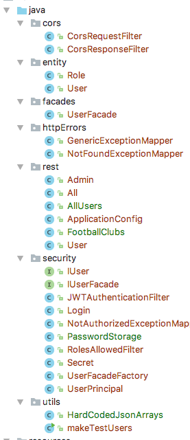
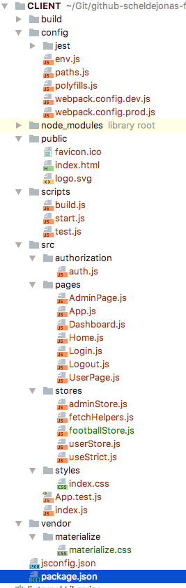

# Structuring Applications

The task description [here](https://github.com/scheldejonas/Exercises/blob/master/EP/exam-preparation_structuringApplications.pdf)

## General part

- Explain the purpose(s) of Java Packages, and how even large programs can be made "understandable" by means of just package- and file-names.
  - To divide a java backend into smaller parts, you start by design the seperation of concerns and choosing a design pattern to seperate from. 
    For example it is possible to separate by the MVC pattern, and just having the basic parts of the domain object data handling seperated through controllers and down to model classes.
    Else you can use a multiarchitectural design, in layers like Web layer, Controller layer, Server layer, 
    The third way to design the packages and java code, is by Feature. This is mostly usefull for RESTful backend servers, to just have a package for one Entity type, with all it's classes to control, service and access database with.
  - In all these ways to divide into smaller parts, the code is easier read by other developers, when you write method names, variable names, class name, package names, to just be the simple understanding of what you get from the different parts of code.
  - This can be used in JavaScript/React the same way.
    In example it is to first choose what design pattern you wanna follow. You can do it by routes, so that, folders are made in samme tree as the Router has it's Route components layed out.
    You could do it in a basic React way, with a component folder, a stores folder (for MobX), a public folder (for index.html and maybe static assets).
    You could do it by pages, for those having nested folder with components.
  - In these ways to divide Components into smaller parts, and refactor your code, to be in mostly React Components, layered in folders of Route structure for example, is making the code much more readable and re-changable to other developers.
- Explain the "architecture" (important folders) of both sides of the seed, 
  - Server: https://github.com/Lars-m/semesterSeedJAX-RS-Backend.git  
    (use your own version with a “real” db and password hashing)
    - 
    - First we are having the ingoing http requests in the "rest" folder, from here the layer of receiving and controlling what other layers to get data from or services to run, in the end the Response is being delivered back to the HTTTP requester, from that folder.
    - Second we are having the folder "facades" to control and manage the database acces through eclipselink JPA provider. It is here the database "facade" is placed. Together with that we have the "entity" folder, for JPA annotations on the data model in the application. it is also used in other folders in the app.
    - Thirdly we have the "security" for managing both the login process and making sure the token after login is corretly checked.
    - Lastly we have the "httpErrors" and "cors" as helpers folders, cors is to add the same-origin headers, for accepting AJAX calls from another domain, then the server running this backend server app. httpErrors is from JAX-RS core, to catch all throwed exceptions, and instead respond with a json object of the error message, instead of the ajax call to just post http error.
  - Client: https://github.com/Lars-m/semesterSeedReactClient.git
    - 
    - Firstly we have "src" with the root index.js file, for starting the react app. and also controlling the Routes for links in app.
    - Secondly we have "src/pages" to contain all the React Components, that display's html, written in jsx. The Components are layered according to each other, from the Rourter setup in index.js
    - Thirdly we have "authorization" folder, to control the login process and save the "securityToken" used to contiously call for JSON content, when clicking through the app.
    - Lastly we have the "src/stores" folder, working kind of like the facade package in Server Backend. Here the MobX library, on Plain JavaScript Classes for each data type, being fetched.
- Explain your additions to the seed (in a previous exercise), focusing on how it handles username and passwords
  - First that password was made able to be saved as a Hash, through the class ```PasswordStorage``` added in the security package.
  - Next in the Entity of the User, setting of a password, was changed to go through the ```PasswordStorage.createHash``` method
  - Next in the UserFacade class, during authenticateUser method, the comparing of password sent from rest call and the hash stored in db, is being verified through ```PasswordStorage.verifyPassword()``` method.
  - Next there was only to actually change the passwords saved in DB to be the actual hash values of the password, and for that the ```makeTestUsers.java``` was built for that.
  - And from here the usrename is the primary key of the user entity, with password saved as hash in the db.

## Practical part

- Change the code to provide a UI as sketched in this figure. Remove all code no longer used (don't touch the backend yet). For the Home Menu Entry, just render a simple message as sketched on the figure
  - **Home.js in pages -> CLIENT**
- Delete existing users from the DB, and add two new users
  - User-1:    userName: Peter, password: test, role: User
  - User-2:    userName: Anne, password: test, role: Admin
  - **MySQL DB on Digital Ocean Server**
- Add the changes, so that All Users (even when not signed in) can see (only) the Home menu-item.
  Users logged in with the User-role can see (also) the User-demo menu-item 
  Users logged in with the Admin-role can see the Admin-demo menu-item **
  - **App.js in pages folder -> CLIENT**
- Change the User-demo page
  - Change the backend to provide an endpoint ```api/footballclubs``` which should return this hardcoded JSON-array, the endpoint must be accessible only for users with the "user" role.
  - **FootballClubs.java in rest package -> SERVER**
- Change the Admin-demo page
  - Change the backend to provide an endpoint: ```api/allusers``` and return the following hard-coded JSON-array beneath
    - **AllUsers in rest package -> SERVER**
  - This endpoint must be accessible <u>only</u>  for users with the "admin" role
    - **AllUsers in rest package -> SERVER**
  - Change the view to render a table with all the users received via the call to the new end-point.
    - **AdminPage in pages -> CLIENT**
  - Add a backend integration test to verify the behaviour of the REST API implemented above
    - **InitialSeedRestIntegrationTest -> SERVER**
  - Upload (and demonstrate) you solution to Digital Ocean (+ Surge if you prefer a separate back-end/front-end)
    - SERVER -> http://178.62.217.182:8080/seedMaven/
    - CLIENT ->  http://exam-project.surge.sh/#/