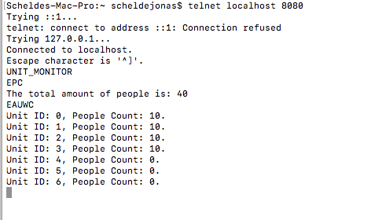

# SP 1 | Jonas Schelde

The overall description is [here](https://github.com/scheldejonas/Exercises/tree/master/SP/SP1)

## Exam task 1 | Threads and Non-blocking Reusable Controls

This task description is [here](https://github.com/scheldejonas/Exercises/blob/master/SP/SP1/Exam-preparation-threads.pdf)

### General part

- When and why we will use Threads in our programs?
  - We are using threads in a program when we wanted to seperate requests made from the Users on to more Processors.
- Explain about the Race Condition Problem and ways to solve it in Java
  - Race Condition is problems on variables or refenrece spaces in ram being accesed from 2 or more different threads, in a value destroying order.
  - The ways to solve Race condition is by placing our threads on the highest level of java code control to run a whole section of code, before next request is able to use those specified instructions in the given methods and variables bound to that section. Use Synchronized methods, Reentrant Locks and Atomic Variables to solve it in code sections.
- Explain how Threads can help us in making responsive User Interfaces
  - Threads makes it possible for let any type of repetative sub task og list of instructions, in our program, be done synchronously. It means the, when having some buttons that start processes, which takes more then a second to run, you are able to let the program handle this process in a seperate core proces, so another core processer can handle the continous pushing or typing in the user interface for example.
- Explain how we can write reusable non-blocking Java Controls using Threads and the observer Pattern
  - We are basicly using the Thread to not let any runners wait for some data coming in, say for example from a REST API over other domains. And we then use then observer Pattern to have universal way to get the, say data fetching places updated, when the synchron runners are done with their list of instructions. So we don't have to give a link to the form, but can just have some runners, which are also observables.

### Practical part

- Implement the Observer Patten, so when the big button is pressed you signal that the GUI would like to be notified when data is ready.

  - The solution is found [here](https://github.com/scheldejonas/Exercises/blob/master/SP/SP1/SOLUTION/jonas_exam_task_threads/src/threadsObserver/synchron_gui_actions/StartFecthingNewRandomUser_ToObservers.java)

  - The Observer is implemented like this

    ```java
    public class StartFecthingNewRandomUser_ToObservers extends Observable implements Runnable {
        private RandomUserControl randomUserControl = new RandomUserControl();

        public StartFecthingNewRandomUser_ToObservers() {
        }

        @Override
        public void run() {
            System.out.println("...synchron Random User Fetcher started.");
            RandomUser randomUser = randomUserControl.fetchRandomUser();
            setChanged();
            notifyObservers(randomUser);
            System.out.println("...synchron Random User Fetcher is finished, and has notified listeners.");
        }
    }

    private void startUpdateWithNewUserSeparatly() {
      StartFecthingNewRandomUser_ToObservers observableFetcher = new StartFecthingNewRandomUser_ToObservers();
      observableFetcher.addObserver(
        new Observer() {
          @Override
          public void update(Observable o, Object arg) {
            System.out.println("...GUI recieved Random User from fetcher.");
            RandomUser randomUser = (RandomUser) arg;
            setInputFieldsWithUser(randomUser);
            System.out.println("...GUI is done updating with recieved Random User.");
            addNewUserStatusLine.setText("Status: DONE, New random user fetched.");
          }
        }
      );
      new Thread(observableFetcher).start();
      addNewUserStatusLine.setText("Status: WAIT, Getting Random User.");
    }
    ```

- Move the time Consuming task into a separate Thread

  - It is implemented in task above.

## Exam task 2 | Thread Programming and Non-blocking Java Servers

The task description is [here](https://github.com/scheldejonas/Exercises/blob/master/SP/SP1/Exam-preparation-network.pdf)

### General part

- When and why we will use Threads in our programs?
  - We are using threads in a program when we wanted to seperate requests made from the Users on to more Processors.
- Explain about the Race Condition Problem and ways to solve it in Java
  - Race Condition is problems on variables or refenrece spaces in ram being accesed from 2 or more different threads, in a value destroying order.
  - The ways to solve Race condition is by placing our threads on the highest level of java code control to run a whole section of code, before next request is able to use those specified instructions in the given methods and variables bound to that section. Use Synchronized methods, Reentrant Locks and Atomic Variables to solve it in code sections.
- Explain how we can write reusable non-blocking Java Controls using Threads
  - By making the controls be coded in a run method and implement the runnable interface.
  - From that in our Application main class, have say a CachedThreadPool Object, to start and execute the incoming jobs to Control classes.
    - For example a TCP server in it's controller waiting for new incoming connections. When ever it receives, it passes the info on to a runnable class in the model layer, for execution synchronously. And all of this is handled in a CachedTheadPool, to make it managed for preventing starvation, race conditions and deadlocks better.
- Explain about deadlocks, how to detect them and ways to solve the Deadlock Problem
  - For example:
    - Detecting deadlocks, is when code is written with lock.lock() locks.
    - Also deadlocks is when running a sleeping method or oberserving method that has lock on it.

### Practical part

- Design a TCP server and a simple protocol where each turnstile initially reports that it is a Turnstile (to distinguish from Monitor-Clients, see next step), its id (turnstile1-turnstile-n) and then reports an increment for each spectator that passes the turnstile

  - This is the Server it self.

  - ``` java
    import controller.ConnectionProcessThread;

    import java.io.IOException;
    import java.net.InetSocketAddress;
    import java.net.ServerSocket;
    import java.net.Socket;
    import java.util.LinkedList;
    import java.util.List;
    import java.util.concurrent.ExecutorService;
    import java.util.concurrent.Executors;
    import java.util.concurrent.ThreadFactory;

    /**
     * Created by scheldejonas on 03/02/17.
     */
    public class Server {

        public static void main(String[] args) {
            Server server = new Server("localhost", 8080);
            server.startServer();
        }

        private final String host;
        private final int port;
        private ThreadFactory threadFactory = Executors.defaultThreadFactory();
        private ExecutorService executorService = Executors.newCachedThreadPool(threadFactory);
        private List<ConnectionProcessThread> procesThreadList = new LinkedList<>();
        private ServerSocket serverSocket = null;

        public Server(String host, int port) {
            this.host = host;
            this.port = port;
        }

        private void startServer() {
            try {
                serverSocket = new ServerSocket();
            } catch (IOException e) {
                e.printStackTrace();
            }
            try {
                System.out.println("...Server is getting binded on " + this.host + ":" + this.port);
                serverSocket.bind(new InetSocketAddress(this.host, this.port));
            } catch (IOException e) {
                System.err.println("...Server didn't succeded getting binded on " + this.host + ":" + this.port);
                e.printStackTrace();
            }
            System.out.println("...Server listening on " + this.host + ":" + this.port);
            System.out.println("...Waiting");
            try {
                Socket socket;
                while ( (socket = serverSocket.accept()) != null) {
                    System.out.println("...Handling connection");
                    ConnectionProcessThread connectionProcessThread = new ConnectionProcessThread();
                    connectionProcessThread.readyProcesWithSocket(socket);
                    procesThreadList.add(connectionProcessThread);
                    executorService.execute(connectionProcessThread);
                    //socket.close();
                    System.out.println("...Connection handled");
                    System.out.println("...Waiting");
                }
            } catch (IOException e) {
                System.err.println("...Error while handling server connections on server");
                e.printStackTrace();
            }
        }
    }
    ```

  - This is the turnstile connection, waiting constantly for the new people walking through the turnstiles and for incrementing the databaes.

  - ```java
    package controller;

    import model.AbstractStadiumProtocol;
    import model.Database;

    import java.io.BufferedReader;
    import java.io.IOException;
    import java.io.InputStream;
    import java.io.InputStreamReader;
    import java.net.Socket;
    import java.util.concurrent.locks.ReentrantLock;

    /**
     * Created by scheldejonas on 06/02/17.
     */
    public class ConnectionProcessThread extends Thread {

        private ReentrantLock reentrantLock = new ReentrantLock();
        private Object unit = null;
        private BufferedReader bufferedReader = null;
        private StadiumProtocol stadiumProtocol = new StadiumProtocol();
        private Database database = Database.getSingleton();

        public ConnectionProcessThread() {
        }

        @Override
        public void run() {
            while (true) {
                try {
                    if (bufferedReader.ready()) {
                        String recievedLine = bufferedReader.readLine();
                        System.out.println("...Received this text from the client: " + recievedLine);
                        Enum command = stadiumProtocol.getMessageReturnCommand(recievedLine);
                        System.out.println("...Received this command from unit: " + command.name());
                        if (command.name().equals("ADD_PERSON")) {
                            long totalPeople = database.addOnePerson();
                            System.out.println("...Added one person to database and it has now: " + totalPeople + " total people.");
                        }
                    }
                } catch (IOException e) {
                    System.out.println("...Error occured when trying to read line from client in ConnectionProcessThread");
                    e.printStackTrace();
                }
            }
        }

        private void defineAndSetTheConnecterUnit(Socket socket) {
            try {
                reentrantLock.lock();
                String connectionString = null;
                try {
                    InputStream inputStream = socket.getInputStream();
                    InputStreamReader inputStreamReader = new InputStreamReader(inputStream);
                    bufferedReader = new BufferedReader(inputStreamReader);
                    connectionString = bufferedReader.readLine();
                    System.out.println("...Server read line from initial posting: " + connectionString);
                    unit = stadiumProtocol.getUnitObject(connectionString);
                    System.out.println("...Server recieved connection from a " + unit.toString());
                } catch (IOException e) {
                    e.printStackTrace();
                }
            } finally {
                reentrantLock.unlock();
            }
        }

        public void readyProcesWithSocket(Socket connectionSocket) {
            defineAndSetTheConnecterUnit(connectionSocket);
        }

        class StadiumProtocol extends AbstractStadiumProtocol {
            public StadiumProtocol() {
                System.out.println("...New StadiumProtocol created.");
            }
        }
    }

    ```

- Identify potential Race Condition Problems that passes the turnstile

  - When adding the person to the database, it is possible for the incrementer to get from one person, while another list of instructions is being ran from another turnstile, so therefore the database must increment asynchronus. I solved Race Condition on the database, like this:

  - ```java
    package model;

    import java.util.concurrent.atomic.AtomicLong;

    /**
     * Created by scheldejonas on 10/04/2017.
     */
    public class Database {
        private static final Database singleton = new Database();
        private AtomicLong peopleEnteredCount = new AtomicLong(0);

        public Database() {
        }

        public long addOnePerson() {
            return peopleEnteredCount.addAndGet(1);
        }

        public static Database getSingleton() {
            return singleton;
        }
    }

    ```

- For this exercise you don't have to implement the turnstile-clients. Use Telnet to simulate the turnstiles.

  - 

    ​

  - 

- Extend the system, so A Monitor-Client can request the current total amount of spectators

  - ```java
    public Commands getMessageReturnCommand(String recievedLine) {
      if (recievedLine.equals("AP")) {
        return Commands.ADD_PERSON;
      }
      if (recievedLine.equals("EPC")) {
        return Commands.ECHO_PEOPLE_COUNT;
      }
      return Commands.DO_NOTHING;
    }
    ```

  - ```java
    if (command.name().equals("ECHO_PEOPLE_COUNT") && unit.getClass().getSimpleName().equals("Monitor")) {
      isCorrectCommandName = true;
      long totalPeople = database.getPeople();
      sendMessage("The total amount of people is: " + totalPeople);
    }
    if (!isCorrectCommandName && unit.getClass().getSimpleName().equals("Monitor")) {
      sendMessage("This is not the correct command for any action on the server. Please try again.");
    }
    ```

  - ```java
    public void sendMessage(String message) throws IOException {
    	System.out.println("...Writing a message: " + message + " to client.");
    	writer.println(message);
    	writer.flush();
    	System.out.println("...Done writing message to client.");
    }
    ```

- Change the example to make it possible to see the count from each turnstile.

  - 

  - ```java
    if (command.equals(model.StadiumProtocol.Commands.ECHO_ALL_UNITS_WITH_COUNT) && unit.getClass().getSimpleName().equals("Monitor")) {
      isCorrectCommandName = true;
      for (Map.Entry<Long, AtomicLong> unit : database.getUnits().entrySet()
          ) {
        sendMessage("Unit ID: " + unit.getKey() + ", People Count: " + unit.getValue() + ".");
      }
    }
    ```