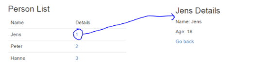

# SP 6 - Solution

af Jonas Schelde | cphbusiness AP degree in computer science

Task description [here](https://docs.google.com/document/d/10uP-SvtCCa03p1y0PdIz4keJYTksQ_j7Dd41RLLw0kU/edit?usp=sharing)

### General part

- Describe the term Single Page Application (SPA) and why it’s relevant for modern web-applications.

  - It is relevant in the big picture to make the site lightning fast when interacting with the site.
  - People are made sure to get the fastest and most interactive experience with the AJAX setup, to both post and get on only the elements they click on.
  - Single Page Applications is also relevant when having a lot of different types of devices that needs to interact with the application.
  - Seen from a developer perspective, it is relevant in a modern would for getting our functional scripting code closer to the users screen, in regards to control on data displayed to the user.

- Describe the overall principles used in React to create a SPA.

  - React is a JavaScript Framework for making User Interfaces.
  - React is built with in a declarative rendering base, through JSX code.
  - React has basicly a virtual environment as duplicate to the real environment the user look into. in regards here talking about the DOM.
  - React is only updating the nescassery components needed when changes are made to the virtual DOM in JSX or through state, props, routes clicks and data changes from AJAX in example.
  - Principles followed are not changeable patterns React is designed by:
    - Composition: Components written by different people needs to work well together.
    - Common Abstraction: Not implementing features that can be done in userland, for none used code to lay in that node library
    - Escape Hatches: Staying accessible to a wide range of developers, and being pragmatic about the declarative code solutions in the framework.
    - Stability: In the sense of "nothing changes", it is not directly what we are seing React, but because it is heavily used by Facebook, Twitter and fx. Airbnb.
    - Interoperability: Because facebook already has a ton of different UI Libraries, it is crucial for the transfer to React, that there libraries are interconnecable and can be declared in them
    - Scheduling: Because React is a declarative language, were it is the core that decides when the elements is actually rendered, instead of you controlling it through Plain JavaScript functions. The scheduling of the best order is controlled by React. Therefore also able to upgrade the order into making it easier and better frame responsiveness, when loading or rendering page.
    - Developer Experience: For example React DevTools to Chrome, are being maintained by Facebook, and therefore it is getting into becoming a rearly good develeoper experience.
    - Debugging: It is vitale importent, you have the same mistake as the user, when working with the User Interface versus that backend code, running on one server. React has it's ability to save, state, Components and Props, for you to restart the same complete environment, as the user were in, during the errors. Especially Redux, which is another state management framework, for saving the browse history constantly, to be sent to developer after error.
    - Configuration: Mostly it is designed for not running with function bound to the global scope. Say for example functions like React.configure(options) or React.register(Component) being implemented, would pose a lot of problems. If somebody calls these functions or another global function from a third-party library. If React app embeds another React app and their desired configuraritons are incompatible. This is a problem. Therefore being served with such methods in the global configuration, will not work.
    - Beond the DOM: When also moving on with the React Native, it is gathering developers around the product, instead of based on code platforms. So it makes the possible tools be fleksible enough for working together with the wide enough reach of people to come together on the right solutions for the actual users / customers, into the desired product, and note based on framework-platform.
    - Implementation: Because code is disposable and often changes, it is vital it doesn't introduce internal abstractions unless absolutely necessary. Verbose code that is easy move around, change is preferred to elegant code that is prematurely abstracted and hard to change.
    - Optimized for Tooling: The names of the methods created is more verbose then shortened. Say  ```componentDidMount()```, could be called ```didMount()``` or ```onMount()```. This is to make the reading and interaction from developers highly visible on what is happening. 
    - Dogfooding: This is a term also used at Facebook a lot, It is the story of the Dog food production company seeing the need for taking their enginered food with them home, to their own dogs, and changing it until they are liking it firstly. In the React world, it is all employees of facebook, finding problems about their products and React library issues, and making their addresments higher priority then the community outside Facebook. Because the longivity of React library is not suppose to stop tomorrow. Therefore they believe in spending time on making the products and React framework likeable and highly usable to them self, and from that hoping others int he outside facebook communities agreeing on this feeling.

- Explain the purpose of Client Side Routing in a SPA.

  - The purpose is to make clicking through the app, happen in an instant, instead of waiting for the http request to get the new dynamic HTML template filled page with data on the server.

- Explain the basic “building blocks” in reac-router.

  - First you need the Router with it's history type.
  - After that you are nesten the Components as children, with the jsx line ```{ this.props.children}``` and say the App component as the highest in the structure has this code. Then based on the to attribute on the Link components inserted, the React environment renderes only the nested parts with the new component, on the url pattern in to attribute.

- This exercise provides some “ready to go” start code. Explain what is required to use react-router with a create-react-app project builded from scratch.
  - You first need to install the library ```npm install --save react-router```  When having this you need to implement the Routings in a separatly js file looking example like this:

  - ```javascript
    /**
     * Created by scheldejonas on 02/04/2017.
     */
    // Libraries
    import React from 'react';
    import { Router, Route, browserHistory, IndexRedirect } from 'react-router';

    // Components
    import FrontPage from './templates/FrontPage';
    import Posts from './container/Posts';
    import NotFound from './components/NotFound';

    // Routes
    const routes = (
      <Router history={browserHistory}>
        <Route path="/" component={FrontPage} />
        <Route path="category/:category" component={Archive}>
          <Route path="posts" component={Posts} />
        </Route>
        <Route path="*" component={NotFound} />
      </Router>
    );

    export default routes;
    ```

  - You are starting the router.js file from the index.js, examply like this:

  - ```javascript
    import React from 'react';
    import { render } from 'react-dom';

    // Components
    import routes from './router';

    render(
      routes
      ,document.getElementById('root')
    );
    ```

  - Then when having the Header in example, the router is used with ``<Link>``` component, like this:

  - ```javascript
    /**
     * Created by scheldejonas on 02/04/2017.
     */
    import React, { Component } from 'react';
    import { Link } from 'react-router';

    class Header extends Component {
      render() {
        return (
          <div>
           	<nav>
              <li><Link to="/category/news">News</Link></li>
            </nav>     
            { this.props.children }
          </div>
        );
      };
    };

    export default Header;
    ```


## Practical part

- Investigate index.js and observer how we pass in a facade property via props to the ```RouterComponent```. Add the necessary code to read this in the ```RouterComponent``` , and pass it on further “down” to ```Persons``` component.

  - ```Javascript
    export default class RouterComponent extends React.Component {

      render() {
        const persons = this.props.facade._persons;
        console.log(persons);
        return (
          <div>
            <Router history={browserHistory}>
              <Route path="/" component={App}>
                <IndexRoute component={Home}></IndexRoute>
                <Route path="persons" component={Persons} persons={persons} />
              </Route>
            </Router>
          </div>
        );
      }
    }
    ```

- Add the necessary changes to the ```Persons``` Component to render all names in a table as sketched above.

  - ```javascript
    import React from "react";

    class Persons extends React.Component {

      render() {
        const persons = this.props.route.persons;
        console.log(persons);
        const personsComponentRows = persons.map((person, index) => (
            <tr key={person.id}>
              <td>{person.id}</td>
              <td>{person.name}</td>
              <td>{person.age}</td>
            </tr>
          )
        );
        return (
          <div>
            <h3>People Table</h3>
            <table>
              <thead>
              <tr>
                <th>ID</th>
                <th>Name</th>
                <th>Age</th>
              </tr>
              </thead>
              <tbody>
              {personsComponentRows}
              </tbody>
            </table>
          </div>
        )
      }
    }

    export default Persons;
    ```

- Add a new Component, ```Details``` (right side of figure below) and the necessary changes so you can navigate to the component via this link: ```persons/details/:id```

  - 

  - ```javascript
    /**
     * Created by scheldejonas on 11/04/2017.
     */
    import React, { Component } from "react";
    import { Link } from 'react-router';

    class Details extends Component {

      render() {
        console.log('...Details pages is filtering all people with id: ' + this.props.params.id);
        const personID = this.props.params.id;
        const person = this.props.route.persons.filter((person) => {
            console.log('...Persons being filtered by: ' + person.id + ', and needle like: ' + personID);
            const filterID = person.id;
            if (filterID == personID) {
              console.log('...Found the person to display.');
              return true;
            }
            return false;
          }
        )[0];
        console.log('...Details page is being rendered with this person: ' + person);
        return (
          <div>
            <div className="title_box">
              <h3>{person.name} Details</h3>
            </div>
            <div className="details_box">
              <p>ID: {person.id}</p>
              <p>Name: {person.name}</p>
              <p>Age: {person.age}</p>
              <p><Link to="persons">Go back</Link></p>
            </div>
          </div>
        )
      }
    }

    export default Details;
    ```

  - ```javascript
    <Route path="persons/details/:id" component={Details} persons={persons}></Route>
    ```

  - ```javascript
    const personsComponentRows = persons.map(
      (person, index) => {
        const linkToPerson = `/persons/details/${person.id}`;
        return (
          <tr key={person.id}>
          <td>{person.name}</td>
          <td>
          <Link to={linkToPerson}>{person.id}</Link>
          </td>
          </tr>
        )
      }
    );
    ```

- If not already done, change the table, created in step-2, to provide the required link for each person to navigate into the Details control.

  - Look above

- Create a new Component NewPerson, and the necessary cahnges to navigate to the component via the "top-menu" as sketched below. Initially you should just add some dummy text in the component to demonstrate that navigation works.

  - ```javascript
    /**
     * Created by scheldejonas on 12/04/2017.
     */
    import React, { Component } from 'react';

    class NewPerson extends Component {
      render() {
        return (
          <div>
            <h3>Add New Person</h3>
            <div className="form_new_person_box">

            </div>
          </div>
        );
      }
    };

    export default NewPerson;
    ```

  - ```javascript
    <Route path="persons/new" component={NewPerson}></Route>

    <li><Link activeClassName="active" to="/persons/new">New Person</Link></li>
    ```

- Add a Form and a save-Button to the NewPerson control, so new persons can be added to the _persons list (the PersonFacade class include a method; addPerson(..) which you should use for this part).

  - ```javascript
    /**
     * Created by scheldejonas on 12/04/2017.
     */
    import React, { Component } from 'react';
    import { browserHistory } from 'react-router';

    class NewPerson extends Component {

      constructor() {
        super();
      }

      addPersonToPersons = (event) => {
        event.preventDefault();
        const newId = this.props.route.facade._persons.length + 1;
        const newName = document.querySelector('#name');
        const newAge = document.querySelector('#age');
        console.log('...Starting to add one person more to the persondata, with new id: ' + newId);
        this.props.route.facade.addPerson({id: newId, name: newName.value, age: newAge.value});
        browserHistory.push('persons');
      };

      render() {
        console.log('...Starting to render New Person component. with facade object: '+ this.props.route.facade);
        return (
          <div>
            <h3>Add New Person</h3>
            <div className="form_new_person_box">
              <form>
                <div>
                  <label htmlFor="name">Name</label>
                  <br/>
                  <input id="name" type="text"></input>
                </div>
                <br/>
                <div>
                  <label htmlFor="age">Age</label>
                  <br/>
                  <input id="age" type="number"></input>
                </div>
                <br/>
                <div>
                  <button type="submit" onClick={this.addPersonToPersons}>Save</button>
                </div>
              </form>
            </div>
          </div>
        );
      }
    };

    export default NewPerson;
    ```

- Only do this, if you have used surge (or similar) before. Publish your solution to a publix URL and demo it from here.

  - The solution is pushed to ```https://schelde-jonas-react-exam-router.surge.sh/``` [here](https://schelde-jonas-react-exam-router.surge.sh/).

  - Here under, the terminal commands was following

  - ```objective-c
    open terminal inside project folder
    npm install --global surge
    npm build
    cd build
    surge
    (type email and password + path and domain)
    ```


