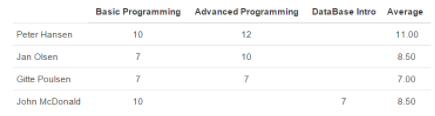

# SP7 | Solution | Jonas Schelde

Here is the initial task description [here](https://github.com/scheldejonas/Exercises/blob/master/SP/SP7/sp-7.md)


## Exam 1 | React, Components and MobX

Here is the task description [here](https://docs.google.com/document/d/1VLPZ9vQ0Fw2rn9EZjb2DBIlSve_hkg-LYFcCwj2KiZ0/edit?usp=sharing)

### General part

- Explain how java programs can be divided up into smaller parts.

  - To divide a java backend into smaller parts, you start by design the seperation of concerns or choosing another design pattern to seperate from. For example it is possible to separate by the MVC pattern, and just having the basic parts of the domain object data handling seperated through controllers and down to model classes.
    Else you can use a multiarchitecural design, in layers like Web layer, Controller layer, Server layer, Dao layer as the distance to the database, from the View layer.
    The third way to design the packages and java code, is by Feature. This is mostly usefull for RESTful backend servers, to just have on package for one Entity type, with all it's classes to control, service and acces database with.
  - In all these ways to divide into smaller parts, the code is easier read by other developers, when you write method names, variable names to just be the simple understanding of what you get from the different parts of code.

- Explain how React app's are composed by Components.

  - React are written in the render method, with the syntax of JSX.
  - This is making the Markup Tags able to be named something more then just HTML.
    In this way React are making Components into Tag's being able to be used in the JSX ```render(){ return }``` method.
  - In whole this makes you able to write code in a module or brick kind of way, where it is re-usable with just taking the components own file into other projects, and then having all the nescessary information to display that dynamic created component in the virtual DOM. And of course after that be automaticly rendered in the Real DOM in your browser.

- Explain how the JavaScript array methods, like filter, map and (reduce) can be used to generate dynamic HTML structures (tables, ul's etc.)

  - JavaScript array, has the methods for iterate over each spot in the array and do different kinds of actions, in regards to filter, map and reduce.

  - Filter is an array method, that takes a callback function with the need to return true or false. The returning of true or false, decides if the object or value in the array spot is being put into the returned new array, after the filter method is iterated.
    To be able to iterate on each value or object in the array, the parameters for the callback function is recieving the datatype in each array spot, for accesing the data iterated.

  - Map is an array method, that takes a callback function for return one variable with the returned text with a line pr. spot or object iterated on in the array.
    Say you wanna loop an array for printing table rows with dynamic filled table cells per object in the array. You go map the array in example like:

  - ```javascript
    let bookTableContent = tableData.books.map( function (book) {
      return (
        <tr key={book.id}>
        <td className="padding_left_right_normal">{book.title}</td>
        <td className="padding_left_right_normal">{book.info}</td>
        </tr>
      );
    });
    ```

- Explain about the Observer pattern, and where you have used it, both with Java, JavaScript and Mobx.

  - In Java we are using the observer pattern especially in Swing GUI's when having the need for ready the UI, to react to the pushed button from the user. The actions listener is used with the Observer pattern, where code is ready made to react by the buttons in UI pushed. All the observers are being notified when the regarded button is being pushed.
  - In Java, we are also using it for separating UI elements directly with the database level. Therefore we are implementing data fetchers in the UI into an observerable. And in the data acces object implementing it with an Observable action, that notifies all connected observers, when data is ready from the server.
  - In JavaScript, we are especially using the observer pattern to eventListeners, that have call back functions. Here the Browser is notifying all observers through JavaScript, when a use pushes button's, where we have setup eventListeners. onClick methods in JSX Tags and so on in React are observer patterned methods in JavaScript.
  - In MobX, we have the data stores being the data acces objects kind of, what we know it from in Java. Here the data stores are being annotated with @Observable on the array variables, because we then are linking it from the Components on changing data and being able to always accesing the same data object. It is kind of like have the observable books example array in constanst state sync, through out the app.

- Explain the differences in designing a Component as an ES6 class versus a pure JavaScript function

  - The React Components comes with more features, then just a stateless pure JavaScript functions.
  - The stateless functions is fully valid to be used in the render() function on the ReactDOM startup JSX code, but there is some missing functionality.
  - The Components have state and have the built in methods to use for reacting with data on specific timing. Fx. componentWillMount are the method being called any time Router changes to the Component in focus. We are having state to be always changeable and updated towards our data handling objects, fx. MobX for sending and receiving data from one place ('store'). The reason we are using Components as React.createClass's, means the data inside is changable through out the alive time. stateless functions are read-only.
  - Therefore when rendering the pure JavaScript function also called a stateless function, we need callback function onClick, when needing to re-edit data in the DOM.

### Practical part 

​					

- Add the necessary code to create the header row (first column is empty, last is the hardcoded value "Average")

  - ```javascript
    var headerRowMapped = studentInfo.headers.map(
      function(course, index) {
        return (
          <th key={course.courseId}>{course.courseName}</th>
        );
      }
    );
    ```

  - ```javascript
    <thead>
      <tr>
        {headerRowMapped}
        <th>Average</th>
      </tr>
    </thead>
    ```

- Add the necessary code to render the rows with name and grades (leave out the average column in this part)

  - ```Javascript
    const studentCellsMapped = studentInfo.students.map(
      (student, index) => {
        return (
          <tr key={student.studentId}>
          <td>{student.name}</td>
          {student.grades.map((grade, index) => {
          return <td key={index}>{grade.grade}</td>;
        })}
      </tr>
    );
    }
    );
    console.log('...StudentCellsMapped is done preparing and are looking like this:');
    console.log(studentCellsMapped);
    ```

  - ```Javascript
    <tbody>
    {studentCellsMapped}
    </tbody>
    ```

- It is assumed that the table will be used in more than one view. Refactor the table-code into a separate React Component ```StudentTable```and include this component in your ```App.js```

  - ```Javascript
    /**
     * Created by scheldejonas on 13/04/2017.
     */
    import React, {Component} from 'react';

    class StudentTable extends Component {

      constructor(props) {
        super(props);
        console.log('...Constructing Student Table Component with courses: ');
        console.log(this.props.courses);
        console.log('...And students:');
        console.log(this.props.students);
        this.state = {
          courses: this.props.courses
          ,students: this.props.students
        };
      };

      render() {
        console.log('...Data Headers is fetched as: ');
        console.log(this.state.headers);
        const headerRowMapped = this.state.courses.map(function(course, index) {
            return (<th key={course.courseId}>{course.courseName}</th>);
          }
        );
        console.log('...HeaderRowMapped is done preparing and are looking like this:');
        console.log(headerRowMapped);
        const studentCellsMapped = this.state.students.map(
          (student, index) => {
            return (
              <tr key={student.studentId}>
                <td>{student.name}</td>
                {student.grades.map((grade, index) => {
                  return <td key={index}>{grade.grade}</td>;
                })}
                <td></td>
              </tr>
            );
          }
        );
        console.log('...StudentCellsMapped is done preparing and are looking like this:');
        console.log(studentCellsMapped);
        return (
          <table className="table">
            <thead>
              <tr>
                <th></th>
                  {headerRowMapped}
                <th>Average</th>
              </tr>
            </thead>
            <tbody>
              {studentCellsMapped}
            </tbody>
          </table>
        )
      };
    }

    export default StudentTable;
    ```

  - ```javascript
    const students = info.studentsInfo.students;
    const courses = info.studentsInfo.headers;

    <StudentTable courses={courses} students={students}></StudentTable>
    ```

- Up until now everything above has not been very reactive, since the table-view does not re-render if we change the list of students (add, remove, etc).
  Use MobX to implement the necessary changes to the dataModel and other files, to make your app reactive (your view updated if you change the model).

  - ```Javascript

    ```

- ?