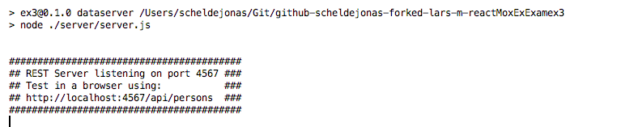

# React, State, Fetch and Mobx

Task hand out [here](https://docs.google.com/document/d/1r9mmyHBYOqEFgNes1aiREIFVLp_EGoQr9EgffCO8spI/edit)

## General part

- Describe the term Single Page Application and why it has become so popular for modern web-applications
  - A single page app, is application, that makes it possible to navigate inside an web app, on a single page.
  - Say that you want to have a small dropdown with options, while you are typing. To accomplish just this, you would need to have the page turn to another page with the dropdown inserted (page blink)
  - And from here with the understanding, it just goes to serving the whole app this way. So that you are actually walking around on the website, through different pages all the time, and still being on the same page.
- Explain the “recommended” React way of passing data into Components (at the top, or at the bottom or..)
  - To pass data into a Stateless functional Component, it is to do it with props.
  - The props will be available, from the attributes you give the component when instancesiating it on another render method.
  - To get data out of an Stateless functional Component, you need to make a call back function, and on top of that, maybe make a reference in react, to be able to get that value typed into, say an input field.
- Explain how JavaScript array methods, like filter, map and (reduce) can be used to generate dynamic HTML structures (tables, ul's etc.)
  - array.map, method on a array, is the loop through each instance in an array, to be able to print out a list of items, or list of say rows in a table.
  - array.filter, ??
  - array.reduce, ??
- Explain about the Observer pattern, and where you have used it, both with Java, JavaScript and Mobx.
  - In Java, the observer pattern is used, f.x. when having a tcp server connection connected in the socket, and we are waiting for the client to send the data. In there we are observing with the .accept method on the socket, for it to send data to our server, so we can run the loops and give back the need data to the client
  - in JavaScript, the observer pattern is used in the event listeners, for waiting with the element to be pushed by a mouse, or for the ajax call to have the correct status, before we are running the data into our UI.
  - In Mobx, the observer pattern is used, when ever a state is changed, and it need to update the other components, with the new state in the app.
- Explain how a library/framework like Mobx fits into the React world, and the actual problems it solves. 
  - ?


## Practical part

Getting started, it is to fork and clone this repo

``` 
git clone -b ejected https://github.com/Lars-m/reactMoxExExamex3.git
```



1. ##### Complete the personFactory to fetch data, using fetch, from the REST-api given above.

   ​

2. ##### 