# SP7 | Solution | Jonas Schelde

Here is the initial task description [here](https://github.com/scheldejonas/Exercises/blob/master/SP/SP7/sp-7.md)


## Exam 1 | React, Components and MobX

Here is the task description [here](https://docs.google.com/document/d/1VLPZ9vQ0Fw2rn9EZjb2DBIlSve_hkg-LYFcCwj2KiZ0/edit?usp=sharing)

### General part

- Explain how java programs can be divided up into smaller parts.

  - To divide a java backend into smaller parts, you start by design the seperation of concerns and choosing a design pattern to seperate from. 
    For example it is possible to separate by the MVC pattern, and just having the basic parts of the domain object data handling seperated through controllers and down to model classes.
    Else you can use a multiarchitectural design, in layers like Web layer, Controller layer, Server layer, 
    The third way to design the packages and java code, is by Feature. This is mostly usefull for RESTful backend servers, to just have a package for one Entity type, with all it's classes to control, service and access database with.
  - In all these ways to divide into smaller parts, the code is easier read by other developers, when you write method names, variable names, class name, package names, to just be the simple understanding of what you get from the different parts of code.

- Explain how React app's are composed by Components.

  - React are written in the render method, with the syntax of JSX.
  - This is making the Markup Tags able to be named something more then just HTML.
    In this way React are making Components into Tag's being able to be used in the JSX ```render(){ return }``` method.
  - In whole this makes you able to write code in a module or brick kind of way, where it is re-usable with just taking the components own file into other projects, and then having all the nescessary information to display that dynamic created component in the virtual DOM. And of course after that be automaticly rendered in the Real DOM in your browser.

- Explain how the JavaScript array methods, like filter, map and (reduce) can be used to generate dynamic HTML structures (tables, ul's etc.)

  - JavaScript array, has the methods for iterate over each spot in the array and do different kinds of actions, in regards to filter, map and reduce.

  - Filter is an array method, that takes a callback function with the need to return true or false. The returning of true or false, decides if the object or value in the array spot is being put into the returned new array, after the filter method is iterated.
    To be able to iterate on each value or object in the array, the parameters for the callback function is recieving the datatype in each array spot, for accesing the data iterated.

  - Map is an array method, that takes a callback function for return one variable with the returned text with a line pr. spot or object iterated on in the array.
    Say you wanna loop an array for printing table rows with dynamic filled table cells per object in the array. You go map the array in example like:

  - ```javascript
    let bookTableContent = tableData.books.map( function (book) {
      return (
        <tr key={book.id}>
        <td className="padding_left_right_normal">{book.title}</td>
        <td className="padding_left_right_normal">{book.info}</td>
        </tr>
      );
    });
    ```

- Explain about the Observer pattern, and where you have used it, both with Java, JavaScript and Mobx.

  - In Java we are using the observer pattern especially in Swing GUI's when having the need for ready the UI, to react to the pushed button from the user. The actions listener is used with the Observer pattern, where code is ready made to react by the buttons in UI pushed. All the observers are being notified when the regarded button is being pushed.
  - In Java, we are also using it for separating UI elements directly with the database level. Therefore we are implementing data fetchers in the UI into an observerable. And in the data acces object implementing it with an Observable action, that notifies all connected observers, when data is ready from the server.
  - In JavaScript, we are especially using the observer pattern to eventListeners, that have call back functions. Here the Browser is notifying all observers through JavaScript, when a use pushes button's, where we have setup eventListeners. onClick methods in JSX Tags and so on in React are observer patterned methods in JavaScript.
  - In MobX, we have the data stores being the data acces objects kind of, what we know it from in Java. Here the data stores are being annotated with @Observable on the array variables, because we then are linking it from the Components on changing data and being able to always accesing the same data object. It is kind of like have the observable books example array in constanst state sync, through out the app.

- Explain the differences in designing a Component as an ES6 class versus a pure JavaScript function

  - The React Components comes with more features, then just a stateless pure JavaScript functions.
  - The stateless functions is fully valid to be used in the render() function on the ReactDOM startup JSX code, but there is some missing functionality.
  - The Components have state and have the built in methods to use for reacting with data on specific timing. Fx. componentWillMount are the method being called any time Router changes to the Component in focus. We are having state to be always changeable and updated towards our data handling objects, fx. MobX for sending and receiving data from one place ('store'). The reason we are using Components as React.createClass's, means the data inside is changable through out the alive time. stateless functions are read-only.
  - Therefore when rendering the pure JavaScript function also called a stateless function, we need callback function onClick, when needing to re-edit data in the DOM.

### Practical part 

​					

- Add the necessary code to create the header row (first column is empty, last is the hardcoded value "Average")

  - ```javascript
    var headerRowMapped = studentInfo.headers.map(
      function(course, index) {
        return (
          <th key={course.courseId}>{course.courseName}</th>
        );
      }
    );
    ```

  - ```javascript
    <thead>
      <tr>
        {headerRowMapped}
        <th>Average</th>
      </tr>
    </thead>
    ```

- Add the necessary code to render the rows with name and grades (leave out the average column in this part)

  - ```Javascript
    const studentCellsMapped = studentInfo.students.map(
      (student, index) => {
        return (
          <tr key={student.studentId}>
          <td>{student.name}</td>
          {student.grades.map((grade, index) => {
          return <td key={index}>{grade.grade}</td>;
        })}
      </tr>
    );
    }
    );
    console.log('...StudentCellsMapped is done preparing and are looking like this:');
    console.log(studentCellsMapped);
    ```

  - ```Javascript
    <tbody>
    {studentCellsMapped}
    </tbody>
    ```

- It is assumed that the table will be used in more than one view. Refactor the table-code into a separate React Component ```StudentTable```and include this component in your ```App.js```

  - ```Javascript
    /**
     * Created by scheldejonas on 13/04/2017.
     */
    import React, {Component} from 'react';

    class StudentTable extends Component {

      constructor(props) {
        super(props);
        console.log('...Constructing Student Table Component with courses: ');
        console.log(this.props.courses);
        console.log('...And students:');
        console.log(this.props.students);
        this.state = {
          courses: this.props.courses
          ,students: this.props.students
        };
      };

      render() {
        console.log('...Data Headers is fetched as: ');
        console.log(this.state.headers);
        const headerRowMapped = this.state.courses.map(function(course, index) {
            return (<th key={course.courseId}>{course.courseName}</th>);
          }
        );
        console.log('...HeaderRowMapped is done preparing and are looking like this:');
        console.log(headerRowMapped);
        const studentCellsMapped = this.state.students.map(
          (student, index) => {
            return (
              <tr key={student.studentId}>
                <td>{student.name}</td>
                {student.grades.map((grade, index) => {
                  return <td key={index}>{grade.grade}</td>;
                })}
                <td></td>
              </tr>
            );
          }
        );
        console.log('...StudentCellsMapped is done preparing and are looking like this:');
        console.log(studentCellsMapped);
        return (
          <table className="table">
            <thead>
              <tr>
                <th></th>
                  {headerRowMapped}
                <th>Average</th>
              </tr>
            </thead>
            <tbody>
              {studentCellsMapped}
            </tbody>
          </table>
        )
      };
    }

    export default StudentTable;
    ```

  - ```javascript
    const students = info.studentsInfo.students;
    const courses = info.studentsInfo.headers;

    <StudentTable courses={courses} students={students}></StudentTable>
    ```

- Up until now everything above has not been very reactive, since the table-view does not re-render if we change the list of students (add, remove, etc).
  Use MobX to implement the necessary changes to the dataModel and other files, to make your app reactive (your view updated if you change the model).

  - ```Javascript
    npm install --save mobx
    npm install --save mobx-react
    ```

  - ```Javascript
    import {observable, action} from 'mobx';

    class StudentInfoFactory {

      @observable courses = [];
      @observable students = [];

      constructor() {
        this.makeData();
      }

      @action
      getCourses = () => {
        return this.courses;
      };

      @action
      getStudents = () => {
        return this.students;
      };

      makeData = (() => {
        this.courses = [
          { courseId: 1000, courseName: "Basic Programming" },
          { courseId: 1001, courseName: "Advanced Programming" },
          { courseId: 1003, courseName: "DataBase Intro" }
        ];
        this.students.push({ studentId: 100, name: "Peter Hansen", grades: [{ grade: "10" }, { grade: "12" }, {}] });
        this.students.push({ studentId: 101, name: "Jan Olsen", grades: [{ grade: "7" }, { grade: "10" }, {}] });
        this.students.push({ studentId: 102, name: "Gitte Poulsen", grades: [{ grade: "7" }, { grade: "7" }, {}] });
        this.students.push({ studentId: 103, name: "John McDonald", grades: [{ grade: "10" }, {}, { grade: "7" }] });
      }).bind(this);
    }

    let info = new StudentInfoFactory();

    //This is only for debugging purposes
    window.info = info.studentsInfo;

    export default info;

    ```

  - ```javascript
    /**
     * Created by scheldejonas on 13/04/2017.
     */
    import React, {Component} from 'react';
    import {observer} from 'mobx-react';
    import info from './dataModel';

    @observer
    class StudentTable extends Component {

      constructor(props) {
        super(props);
        this.state = {
          courses: []
          ,students: [
            {
              studentId: 0
              ,name: ''
              ,grades: []
            }
          ]
        };
        console.log('...Constructing Student Table Component with courses: ');
        console.log(this.state.courses);
        console.log('...And students:');
        console.log(this.state.students);
      };

      componentWillMount() {
        this.setState(
          {
            courses: info.getCourses()
            ,students: info.getStudents()
          }
        );
        console.log('...I re-rendered because oberservable changed from dataModel');
      }
    ```


## Exam 2 | React, State, Fetch and MobX

Task description is [here](https://docs.google.com/document/d/1BYq0FfEH-luNuxduJL9cgJ6IIPMHjFvyYWTSAlsjRnk/edit?usp=sharing)

### General part

- Describe the term Single Page Application and why it has become so popular for modern web-applications.

  - It is popular in the big picture to make the site lightning fast when interacting with the site.
  - People are made sure to get the fastest and most interactive experience with the AJAX setup, to both post and get on only the elements they click on.
  - Single Page Applications is also relevant when having a lot of different types of devices that needs to interact with the application.
  - Seen from a developer perspective, it is relevant in a modern would for getting our functional scripting code closer to the users screen, in regards to control on data displayed to the user.

- Explain the “recommended” React way of passing data into Components (at the top, or at the bottom or..)Explain how JavaScript array methods, like filter, map and (reduce) can be used to generate dynamic HTML structures (tables, ul's etc.)

  - JavaScript array, has the methods for iterate over each spot in the array and do different kinds of actions, in regards to filter, map and reduce.

  - Filter is an array method, that takes a callback function with the need to return true or false. The returning of true or false, decides if the object or value in the array spot is being put into the returned new array, after the filter method is iterated.
    To be able to iterate on each value or object in the array, the parameters for the callback function is recieving the datatype in each array spot, for accesing the data iterated.

  - Map is an array method, that takes a callback function for return one variable with the returned text with a line pr. spot or object iterated on in the array.
    Say you wanna loop an array for printing table rows with dynamic filled table cells per object in the array. You go map the array in example like:

  - ```Javascript
    let bookTableContent = tableData.books.map( function (book) {
      return (
        <tr key={book.id}>
        <td className="padding_left_right_normal">{book.title}</td>
        <td className="padding_left_right_normal">{book.info}</td>
        </tr>
      );
    });
    ```

- Explain about the Observer pattern, and where you have used it, both with Java, JavaScript and Mobx.

  - In Java we are using the observer pattern especially in Swing GUI's when having the need for ready the UI, to react to the pushed button from the user. The actions listener is used with the Observer pattern, where code is ready made to react by the buttons in UI pushed. All the observers are being notified when the regarded button is being pushed.
  - In Java, we are also using it for separating UI elements directly with the database level. Therefore we are implementing data fetchers in the UI into an observerable. And in the data acces object implementing it with an Observable action, that notifies all connected observers, when data is ready from the server.
  - In JavaScript, we are especially using the observer pattern to eventListeners, that have call back functions. Here the Browser is notifying all observers through JavaScript, when a use pushes button's, where we have setup eventListeners. onClick methods in JSX Tags and so on in React are observer patterned methods in JavaScript.
  - In MobX, we have the data stores being the data acces objects kind of, what we know it from in Java. Here the data stores are being annotated with @Observable on the array variables, because we then are linking it from the Components on changing data and being able to always accesing the same data object. It is kind of like have the observable books example array in constanst state sync, through out the app.

- Explain how a library/framework like Mobx fits into the React world, and the actual problems it solves. 

  - MobX is a made as a simple State management Library.
  - The issue about react for state is to have dynamicly the newest or correct data available all the time.
  - To do this, MobX are going in and using the observer patterns, by just having the plain JavaScript Class for controlling the array's or variables of data, that needs to be the same on all Components and pages at the same time.
  - So when a change is made to the observable object or array of any data type, the observers get notified with the updated data.

### Pratical part

- Complete the personFactory to fetch data, using fetch, from the REST-api given above.

  - 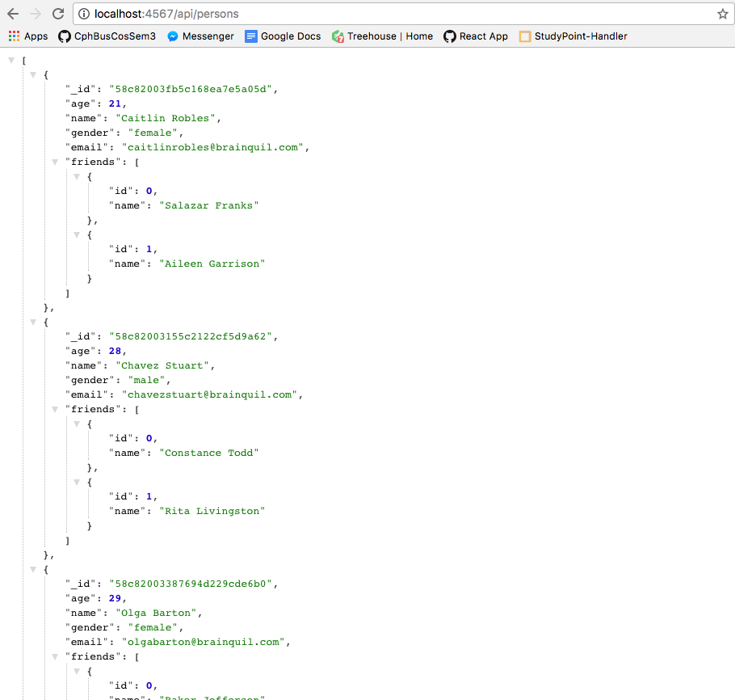

  - ```javascript
    class PersonFactory {

      constructor() {
        this.persons = [];
        console.log('...Done constructing, and persons in PersonFactory, now looks like this:');
        console.log(this.persons);
      }

      getPersons = () => {
        console.log('...Starting to fetch all persons from the RESTfull API');
        fetch('http://localhost:4567/api/persons')
            .then(
              response => {
                console.log('...Receiving response looking like this:');
                console.log(response);
                return response.json();
              }
            )
            .then(responseData => {
                console.log('...Starting to move data from response into variable in frontend;');
                console.log(responseData);
                this.persons = responseData;
                console.log('...Done fetching and this.persons now looks like:');
                console.log(this.persons);
              }
            )
            .catch(error => {
                console.log('Error fetching and parsing data', error);
              }
            );
      }
    }

    export default new PersonFactory();
    ```

- Use your updated personFactory and "inject" it into relevant controls so it will be available via props in PersonTable Control.

  - Starting by placing state in th up most needed Component on Person Table

  - ```javascript
    import React, {Component} from 'react';
    import PersonTable from "./PersonTable";
    import './App.css';
    import '../vendor/materialize/materialize.css';
    import personTable from './personFactory';

    class App extends Component {
      
      constructor(props){
        super(props);
        this.state = {
          persons: personTable.persons
        }
      }

      onGetPersons = () => {
        personTable.getPersons();
        console.log('...Starting to sleep for 5 sec.');
        setTimeout((
          () => {
            console.log('...Done Sleeping.');
            this.setState(
              {
                persons: personTable.persons
              }
            );
          }).bind(this), 100);
      };

      render() {
        return (
          <div className="">
            <nav>
              <div className="nav-wrapper">
                <a href="#" className="brand-logo center">React, State, Fetch and Mobx</a>
                <ul id="nav-mobile" className="left hide-on-med-and-down">
                  <li><a href="/">Person Table</a></li>
                </ul>
              </div>
            </nav>
            <div className="App-intro">
              <PersonTable persons={this.state.persons} getPersons={this.onGetPersons} />
            </div>
          </div>
        );
      }
    }

    export default App;
    ```

- Add the necessary code to PersonTable to render a table as sketched here

  - ```javascript
    import React, { Component } from "react";

    class PersonTable extends Component {
      constructor(props) {
        super(props);
        console.log('...Creating PersonTable Component.');
      };

      componentWillMount() {
        console.log('...Starting to get new persons, and waiting for the data to populate with state.');
        this.props.getPersons();
      }

      render() {

        const personsMappedInRows = this.props.persons.map(
          (person, index) => {
            return (
              <tr key={person._id}>
                <td>{person.age}</td>
                <td>{person.name}</td>
                <td>{person.gender}</td>
                <td>{person.email}</td>
                <td>{
                  person.friends.map(
                    (friend, index) => {
                      return (
                        <div key={friend.id}>
                          {friend.name}
                        </div>
                      )
                    }
                  )
                }</td>
              </tr>
            );
          }
        );

        return (
          <table className="table">
            <thead>
              <tr>
                <th>Age</th>
                <th>name</th>
                <th>Gender</th>
                <th>Email</th>
                <th>Friends</th>
              </tr>
            </thead>
            <tbody>
              {personsMappedInRows}
            </tbody>
          </table>
        );
      }
    }
    export default PersonTable;
    ```

- Change the code that generates the Table to provide a comma-separated list of all friend, instead of just the number of friends.

  - ```javascript
    <td>{
      person.friends.map(
        (friend, index) => {
          return (
            <span key={friend.id}>
              {friend.name},&nbsp;
            </span>
          )
        }
      )
    }</td>
    ```

  - 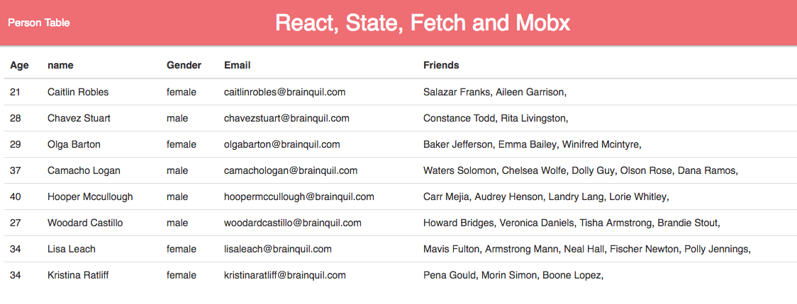

- Change personFactory to use MobX for event-Handling (it must be possible to observe the persons array).
  Add the necessary code to other Components (where required) to observe the persons array.

  - ```javascript
    import {extendObservable, action} from "mobx";

    class personFactory {

      constructor() {
        extendObservable(this, {
          persons: [
            {
              _id: 0
              ,age: 0
              ,name: ''
              ,gender: ''
              ,email: ''
              ,friends: [
                {
                  id: 0
                  ,name: ''
                }
              ]
            }
          ]
          ,fetchPeople: action(function() {
            fetch('http://localhost:4567/api/persons')
              .then(
                (response) => {
                  console.log('...Receiving response looking like this:');
                  console.log(response);
                  return response.json();
                }
              )
              .then(
                (responseData) => {
                  console.log('...Starting to move data from response into variable in frontend;');
                  console.log(responseData);
                  this.persons = responseData;
                  console.log('...Done fetching and this.persons now looks like:');
                  console.log(this.persons);
                }
              )
              .catch(
                (error) => {
                  console.log('Error fetching and parsing data', error);
                }
              );
          })
        });
      }
    }

    let personData = new personFactory();

    export default personData;
    ```

  - ```javascript
    import React, { Component } from "react";
    import {observer} from 'mobx-react';
    import personData from './personFactory';

    class PersonTable extends Component {
      constructor(props) {
        super(props);
        console.log('...Creating PersonTable Component.');
      };

      componentWillMount() {
        console.log('...Starting to get new persons, and waiting for the data to populate with state.');
        personData.fetchPeople();
      }

      render() {
        const personsMappedInRows = personData.persons.map(
          (person, index) => {
            return (
              <tr key={person._id}>
                <td>{person.age}</td>
                <td>{person.name}</td>
                <td>{person.gender}</td>
                <td>{person.email}</td>
                <td>{
                    person.friends.map(
                    (friend, index) => {
                      return (
                        <span key={friend.id}>
                          {friend.name},&nbsp;
                        </span>
                      )
                    }
                  )
                }</td>
              </tr>
            );
          }
        );

        return (
          <table className="table">
            <thead>
              <tr>
                <th>Age</th>
                <th>name</th>
                <th>Gender</th>
                <th>Email</th>
                <th>Friends</th>
              </tr>
            </thead>
            <tbody>
              {personsMappedInRows}
            </tbody>
          </table>
        );
      }
    }
    export default observer(PersonTable);
    ```

- Change the URL in personFactory into this one http://localhost:4567/api/persons_changing/ , and use JavaScript’s setInterval function to repeatedly update the person's array with fresh data from the server (while developing, fetch every 3 seconds to see changes).

  - ```javascript
    import React, { Component } from "react";
    import {observer} from 'mobx-react';
    import personData from './personFactory';

    class PersonTable extends Component {
      constructor(props) {
        super(props);
        console.log('...Creating PersonTable Component.');
        let updateTable = '';
      };
    ```


      componentWillMount() {
        console.log('...Starting to get new persons, and waiting for the data to populate with state.');
        personData.fetchPeople();
      }
    
      updateTablePerSecond = (
        () => {
          personData.fetchChangingPeople();
          this.updateTable =
            setInterval(
              () => {
                personData.fetchChangingPeople();
              }
              ,3000
            );
        }
      );
    
      stopUpdating = (
        () => {
          clearInterval(this.updateTable);
        }
      );
    
      render() {
        const personsMappedInRows = personData.persons.map(
          (person, index) => {
            return (
              <tr key={person._id}>
                <td>{person.age}</td>
                <td>{person.name}</td>
                <td>{person.gender}</td>
                <td>{person.email}</td>
                <td>{
                    person.friends.map(
                    (friend, index) => {
                      return (
                        <span key={friend.id}>
                          {friend.name},&nbsp;
                        </span>
                      )
                    }
                  )
                }</td>
              </tr>
            );
          }
        );
    
        return (
          <div className="">
            <div className="row">
              <div className="col s6 right-align">
                <a onClick={this.updateTablePerSecond} className="waves-effect waves-light green lighten-2 btn"><i className="material-icons right">cloud</i>Start updating</a>
              </div>
              <div className="col s6 left-align">
                <a onClick={this.stopUpdating} className="waves-effect waves-light red lighten-2 btn">Stop updating</a>
              </div>
            </div>
            <table className="table">
              <thead>
                <tr>
                  <th>Age</th>
                  <th>name</th>
                  <th>Gender</th>
                  <th>Email</th>
                  <th>Friends</th>
                </tr>
              </thead>
              <tbody>
                {personsMappedInRows}
              </tbody>
            </table>
          </div>
        );
      }
    }
    export default observer(PersonTable);
    ​```


## Exam 3 | Structuring Applications

The task description is [here](https://docs.google.com/document/d/1h1Me0XZaZPvrO3OApNYfPW4jmh8ByEJKsvwCCwXd4HY/edit?usp=sharing)

### General part

- Explain the purpose(s) of Java Packages, and how even large programs can be made "understandable" by means of just package- and file-names. How can something similar be achieved with JavaScript/React.
  - To divide a java backend into smaller parts, you start by design the seperation of concerns and choosing a design pattern to seperate from. 
    For example it is possible to separate by the MVC pattern, and just having the basic parts of the domain object data handling seperated through controllers and down to model classes.
    Else you can use a multiarchitectural design, in layers like Web layer, Controller layer, Server layer, 
    The third way to design the packages and java code, is by Feature. This is mostly usefull for RESTful backend servers, to just have a package for one Entity type, with all it's classes to control, service and access database with.
  - In all these ways to divide into smaller parts, the code is easier read by other developers, when you write method names, variable names, class name, package names, to just be the simple understanding of what you get from the different parts of code.
  - This can be used in JavaScript/React the same way.
    In example it is to first choose what design pattern you wanna follow. You can do it by routes, so that, folders are made in samme tree as the Router has it's Route components layed out.
    You could do it in a basic React way, with a component folder, a stores folder (for MobX), a public folder (for index.html and maybe static assets).
    You could do it by pages, for those having nested folder with components.
  - In these ways to divide Components into smaller parts, and refactor your code, to be in mostly React Components, layered in folders of Route structure for example, is making the code much more readable and re-changable to other developers.
- Explain the "architecture" (important folders) of both sides of the seed, 
  - Server: https://github.com/Lars-m/semesterSeedJAX-RS-Backend.git  
    (use your own version with a “real” db and password hashing)
    - 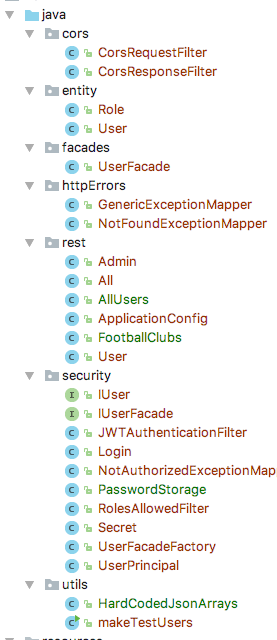
    - First we are having the ingoing http requests in the "rest" folder, from here the layer of receiving and controlling what other layers to get data from or services to run, in the end the Response is being delivered back to the HTTTP requester, from that folder.
    - Second we are having the folder "facades" to control and manage the database acces through eclipselink JPA provider. It is here the database "facade" is placed. Together with that we have the "entity" folder, for JPA annotations on the data model in the application. it is also used in other folders in the app.
    - Thirdly we have the "security" for managing both the login process and making sure the token after login is corretly checked.
    - Lastly we have the "httpErrors" and "cors" as helpers folders, cors is to add the same-origin headers, for accepting AJAX calls from another domain, then the server running this backend server app. httpErrors is from JAX-RS core, to catch all throwed exceptions, and instead respond with a json object of the error message, instead of the ajax call to just post http error.
  - Client: https://github.com/Lars-m/semesterSeedReactClient.git
    - 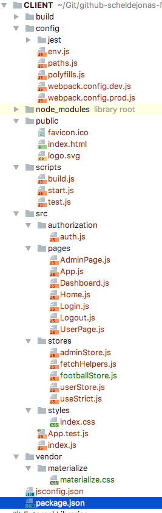
    - Firstly we have "src" with the root index.js file, for starting the react app. and also controlling the Routes for links in app.
    - Secondly we have "src/pages" to contain all the React Components, that display's html, written in jsx. The Components are layered according to each other, from the Rourter setup in index.js
    - Thirdly we have "authorization" folder, to control the login process and save the "securityToken" used to contiously call for JSON content, when clicking through the app.
    - Lastly we have the "src/stores" folder, working kind of like the facade package in Server Backend. Here the MobX library, on Plain JavaScript Classes for each data type, being fetched.
- Explain your additions to the seed (in a previous exercise), focusing on how it handles username and passwords
  - First that password was made able to be saved as a Hash, through the class ```PasswordStorage``` added in the security package.
  - Next in the Entity of the User, setting of a password, was changed to go through the ```PasswordStorage.createHash``` method
  - Next in the UserFacade class, during authenticateUser method, the comparing of password sent from rest call and the hash stored in db, is being verified through ```PasswordStorage.verifyPassword()``` method.
  - Next there was only to actually change the passwords saved in DB to be the actual hash values of the password, and for that the ```makeTestUsers.java``` was built for that.
  - And from here the usrename is the primary key of the user entity, with password saved as hash in the db.
- Explain how we can handle state "outside" our react Components using Plain JavaScript and the Mobx library
  - To make the states, with dynamicly changing data accesiable to all React Components is done by MobX library, which uses the observer pattern.
  - There we are having variables or arrays of data in JSON format being the observables.
  - When ever we then are calling getData methods in the plain JavaScript classes. MobX are fetching data, that sets the observable array again, for after that to notify all observers, which we then place.
  - In the same way, using it for setting data, to the database, and making the setting of new data, call the get data again.
  - For making all this to work, that implementation og mobx-react also needs to be installed, for the observers, to re-render the Components listening on observables that change.


### Practical part

- Change the code to provide a UI as sketched in this figure. Remove all code no longer used (don't touch the backend yet). For the Home Menu Entry, just render a simple message as sketched on the figure

  - 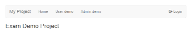

  - ```javascript
    import React, { Component } from 'react'
    import { Link } from "react-router";
    import auth from '../authorization/auth'
    import { observer } from "mobx-react";

    import "..//stores/useStrict";

    const App = observer(class App extends Component {

      render() {
        const NavLink = (props) => {
          return (
            <Link {...props} activeClassName="active" />
          );
        };
        const logInStatus = auth.loggedIn ? "Logged in as: " + auth.userName : "";
        return (
          <div>
            <nav>
              <div className="nav-wrapper blue lighten-2">
                <ul id="nav-mobile" className="hide-on-med-and-down">
                  <li><Link to="#" className="text-size-custom-1">Exam Project</Link></li>
                  <li><NavLink to="/home">Home</NavLink></li>
                  <li><NavLink to="/user">User demo</NavLink></li>
                  <li><NavLink to="/admin">Admin demo</NavLink></li>
                </ul>
                <ul className="hide-on-med-and-down right">
                  <li className="navbar-text" style={{ color: "steelBlue" }}>{logInStatus}</li>
                  <li>
                    {auth.loggedIn
                      ? (
                        <NavLink to="/logout"><span className="glyphicon glyphicon-log-in"></span>Logout</NavLink>
                      )
                      : (
                        <NavLink to="/login">
                          <span className="glyphicon glyphicon-log-out"></span>Login</NavLink>
                      )
                    }
                  </li>
                </ul>
              </div>
            </nav>
            {this.props.children || <p>You are {!auth.loggedIn && 'not'} logged in.</p>}
          </div>
        )
      }
    });

    export default App;
    ```

  - 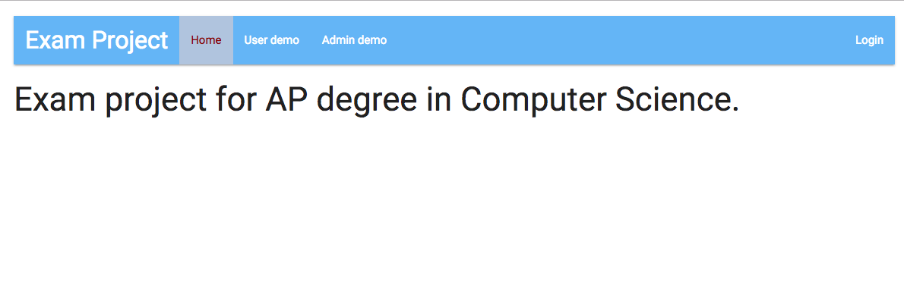

- Delete existing users from the DB, and add two new users

  - User-1:    userName: Peter, password: test, role: User

  - User-2:    userName: Anne, password: test, role: Admin

  - ```Java
    em.getTransaction().begin();
    Role userRole = new Role("User");
    Role adminRole = new Role("Admin");
    User user = new User("Peter", "test");
    user.addRole(userRole);
    User admin = new User("Anne", "test");
    admin.addRole(adminRole);
    em.persist(userRole);
    em.persist(adminRole);
    em.persist(user);
    em.persist(admin);
    em.getTransaction().commit();
    System.out.println("Created TEST Users");
    ```

  - 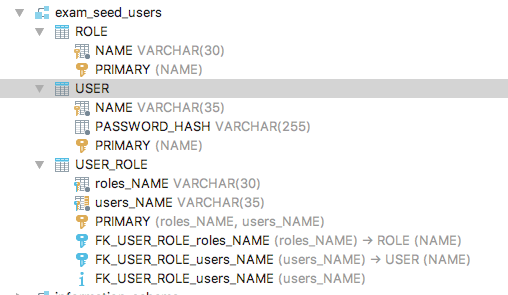

  - 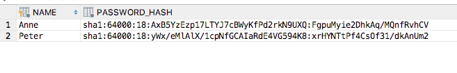

  - ​

- Add the changes, so that
  All Users (even when not signed in) can see (only) the Home menu-item.
  Users logged in with the User-role can see (also) the User-demo menu-item 
  Users logged in with the Admin-role can see the Admin-demo menu-item **

  - ```Javascript
    {auth.isUser
      && <li><NavLink to="/user">User demo</NavLink></li>
    }
    {auth.isAdmin
      && <li><NavLink to="/admin">Admin demo</NavLink></li>
    }
    ```

- Change the User-demo page

  - Change the backend to provide an endpoint ```api/footballclubs``` which should return this hardcoded JSON-array, the endpoint myst be accessible only for users with the "user" role

  ```json
  [
    {
      "name":"Liverpool"
      ,"url":"http://www.liverpoolfc.com"
    }
    ,{
      "name":"Manchester United"
      ,"url" : "http://www.manutd.com/"
    }
  ]
  ```

  - ```java
    package rest;

    import com.google.gson.*;

    import javax.annotation.security.RolesAllowed;
    import javax.ws.rs.GET;
    import javax.ws.rs.Path;
    import javax.ws.rs.Produces;
    import javax.ws.rs.core.MediaType;
    import javax.ws.rs.core.Response;

    /**
     * Created by scheldejonas on 15/04/2017.
     */
    @Path("footballclubs")
    @RolesAllowed("User")
    public class FootballClubs {

        Gson gson = new GsonBuilder().setPrettyPrinting().create();

        @GET
        @Produces(MediaType.APPLICATION_JSON)
        public Response getTwoHardcodedClubs() {

            JsonObject jsonObject = new JsonObject();
            jsonObject.addProperty("name","Liverpool");
            jsonObject.addProperty("url","http://www.liverpoolfc.com");
            JsonObject jsonObject1 = new JsonObject();
            jsonObject1.addProperty("name", "Manchester United");
            jsonObject1.addProperty("url", "http://www.manutd.com");
            JsonArray jsonArray = new JsonArray();
            jsonArray.add(jsonObject);
            jsonArray.add(jsonObject1);

            return Response
                    .status(Response.Status.OK)
                    .entity(gson.toJson(jsonArray))
                    .build();
        }
    }
    ```

  - Change the view to render an unordered list, with (working) links for to each club received via the new endpoint

  - ```javascript
    componentWillMount() {
          /*
         This will fetch data each time you navigate to this route
         Move to constructor, if only required once, or add "logic" to determine when data should be "refetched"
         */
          userData.getData();
          footballData.getData();
        }

        render() {
          const footballClubsMappedAsListItems = footballData.footballClubs.map(
            (footballClub, index) => {
              return (
                <li key={footballClub.name} className="collection-item">
                  <div>
                    <span>{footballClub.name}</span>
                    <a href={footballClub.url} target="_blank" className="secondary-content">
                      <i className="material-icons">send</i>
                    </a>
                  </div>
                </li>
              );
            }
          );
          return (
            <div className="row">
              <div className="col s12">
                <h4 style={{ color: "red" }}>{footballData.errorMessage}</h4>
              </div>
              <div className="col s12">
                <ul className="collection with-header">
                  <li className="collection-header"><h4>Football Clubs</h4></li>
                  {footballClubsMappedAsListItems}
                </ul>
              </div>
            </div>
          )
        }
    ```

  - ``` java
    @Test
    public void testRestForFootballClubs() {
      JsonArray jsonArray = HardCodedJsonArrays.getFootballClubs();
      login("Peter", "test");
      given()
        .contentType("application/json")
        .header("Authorization", "Bearer " + securityToken)
        .when()
        .get("api/footballclubs").then()
        .statusCode(200)
        .body(equalTo(gson.toJson(jsonArray)));
    }
    ```

- Change the Admin-demo page

  - Change the backend to provide an endpoint: ```api/allusers``` and return the following hard-coded JSON-array beneath

  - This endpoint must be accessible <u>only</u>  for users with the "admin" role

  - Change the view to render a table with all the users received via the call to the new end-point.

  - Add a backend integration test to verify the behaviour of the REST API implemented above

  - ```json
    [
      {
        "name": "Jan"
        ,"mail":"j@a.dk"
      }
      ,{
        "name":"Ann"
        ,"mail":"a@a.dk"
      }
      ,{
        "name":"ib"
        ,"mail":"i@a.dk"
      }
    ]
    ```

    - ```java
      package rest;
      ```

    import com.google.gson.Gson;
    import com.google.gson.GsonBuilder;
    import com.google.gson.JsonArray;
    import com.google.gson.JsonObject;

    import javax.annotation.security.RolesAllowed;
    import javax.ws.rs.GET;
    import javax.ws.rs.Path;
    import javax.ws.rs.Produces;
    import javax.ws.rs.core.MediaType;
    import javax.ws.rs.core.Response;

    /**
    *  Created by scheldejonas on 15/04/2017.
       */
       @Path("allusers")
       @RolesAllowed("Admin")
       public class AllUsers {

        Gson gson = new GsonBuilder().setPrettyPrinting().create();

        @GET
        @Produces(MediaType.APPLICATION_JSON)
        public Response getAllUsersFromHardCoded() {
            JsonArray jsonArray = new JsonArray();
            for (int i = 0; i < 3; i++) {
                JsonObject jsonObject = new JsonObject();
                for (int ii = 0; ii < 2; ii++) {
                    String property = "";
                    String value = "";
                    if (i == 0 && ii == 0) {
                        property = "name";
                        value = "Jan";
                    }
                    if (i == 0 && ii == 1) {
                        property = "mail";
                        value = "j@a.dk";
                    }
                    if (i == 1 && ii == 0) {
                        property = "name";
                        value = "Ann";
                    }
                    if (i == 1 && ii == 1) {
                        property = "mail";
                        value = "a@a.dk";
                    }
                    if (i == 2 && ii == 0) {
                        property = "name";
                        value = "ib";
                    }
                    if (i == 2 && ii == 1) {
                        property = "mail";
                        value = "i@a.dk";
                    }
                    jsonObject.addProperty(property,value);
                }
                jsonArray.add(jsonObject);
            }
            return Response
                    .status(Response.Status.OK)
                    .entity(gson.toJson(jsonArray))
                    .build();
        }
       }
    ```

    ```

  - ```javascript
    import React, { Component } from 'react'
    import {observer} from "mobx-react";
    import userData from "../stores/userStore";

    const AdminPage = observer(
      class AdminPage extends Component {

        componentWillMount() {
          /*
          This will fetch data each time you navigate to this route
          Move to constructor, if only required once, or add "logic" to determine when data should be "refetched"
          */
          userData.getData();
        }

        render() {
          const allUsersMappedAsTableRows = userData.allusers.map(
            (user, index) => {
              return (
                <tr key={user.mail}>
                  <td>{user.name}</td>
                  <td>{user.mail}</td>
                </tr>
              );
            }
          );
          return (
            <div className="container">
            <div className="row">
              <div className="col s12">
                <h4 style={{ color: "red" }}>{userData.errorMessage}</h4>
              </div>
              <div className="col s12">
                <table className="striped centered">
                  <thead>
                    <tr>
                      <th>Name</th>
                      <th>Email</th>
                    </tr>
                  </thead>
                  <tbody>
                    {allUsersMappedAsTableRows}
                  </tbody>
                </table>
              </div>
            </div>
            </div>
          )
        }

      }
    )
    export default AdminPage;
    ```

  - ```javascript

    import { observable, action } from "mobx";
    import fetchHelper from "./fetchHelpers"
    const URL = require("../../package.json").serverURL;
    ```


    class UserStore {
      @observable allusers = [];
      @observable errorMessage = "";
    
      @action
      setErrorMessage = (err) => {
        this.errorMessage = err;
      }
    
      @action
      getData = () => {
        this.errorMessage = "";
        this.messageFromServer = "";
        let errorCode = 200;
        const options = fetchHelper.makeOptions("GET", true);
        fetch(URL + "api/allusers", options)
          .then((res) => {
            if (res.status > 210 || !res.ok) {
              errorCode = res.status;
            }
            return res.json();
          })
          .then(action((res) => {
            if (errorCode !== 200) {
              throw new Error(`${res.error.message} (${res.error.code})`);
            }
            else {
              console.log('...Done fetching from server and recieved message like this:');
              console.log(res);
              this.allusers = res;
            }
          })).catch(err => {
            //This is the only way (I have found) to verify server is not running
            this.setErrorMessage(fetchHelper.addJustErrorMessage(err));
          })
      }
    }
    
    let userStore = new UserStore();
    
    //Only for debugging
    //window.userStore = userStore;
    export default userStore;
    
    ​```

-   ```java
    @Test
    public void testRestForAllUsers() {
      JsonArray jsonArray = HardCodedJsonArrays.getAllUsers();
      login("Anne", "test");
      given()
        .contentType("application/json")
        .header("Authorization", "Bearer " + securityToken)
        .when()
        .get("api/allusers").then()
        .statusCode(200)
        .body(equalTo(gson.toJson(jsonArray)));
    }
    ```

- Upload (and demonstrate) you solution to Digital Ocean (+ Surge if you prefer a separate back-end/front-end)

  - http://178.62.217.182:8080/seedMaven/
  - 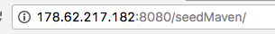
  - 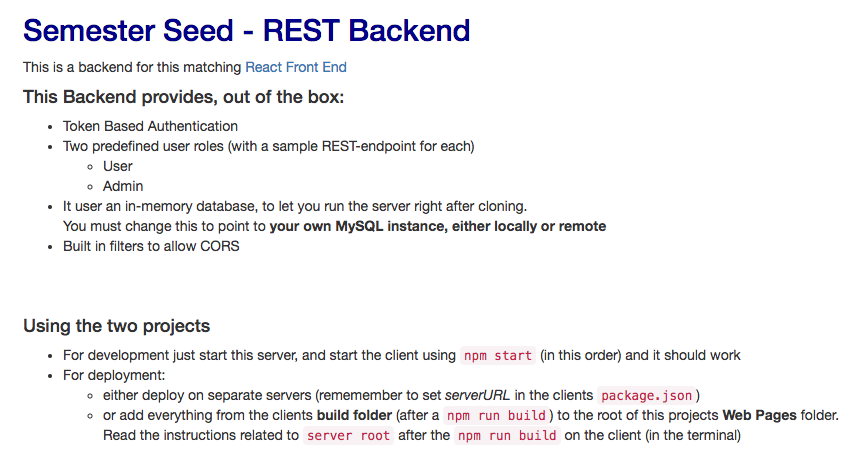
  - PUBLIC: http://exam-project.surge.sh/#/
  - 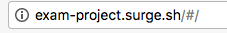
  - 

